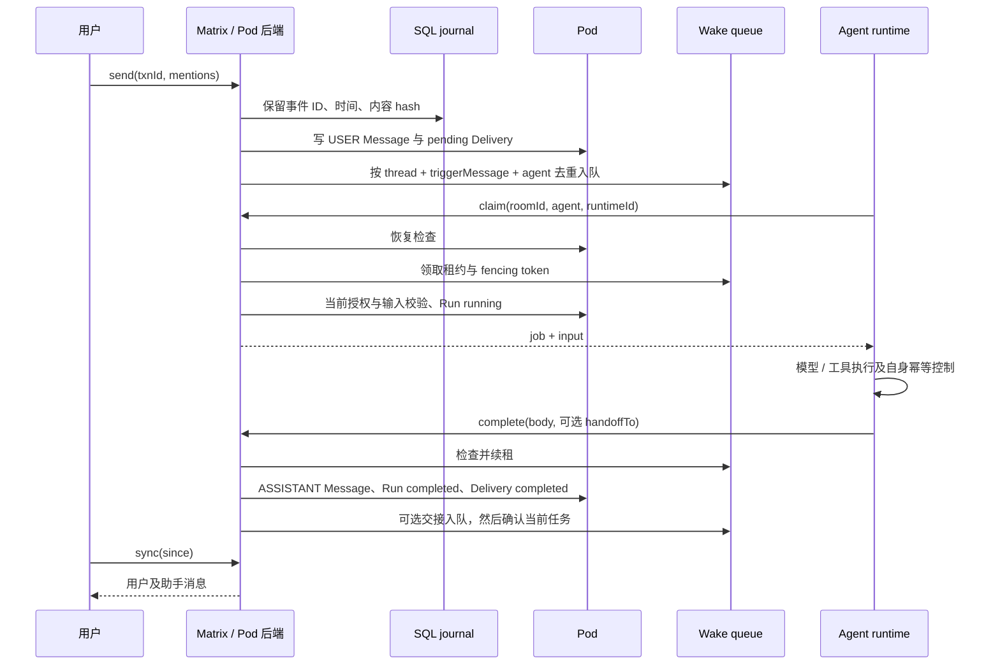

# Matrix 多智能体协作设计与验收契约

更新：2026-09-23。本文描述仓库当前实现；验收门禁与通过证据分开记录，不以设计完成代替运行通过。

## 产品边界

Matrix 是共享 Pod 聊天模型的 Client–Server 兼容入口。当前提供消息同步、显式 Agent 授权、可领取的执行任务、结果回写及受控交接；执行器负责模型、工具和工作区的实际执行。服务不会因为房间没人在线而自行启动 LLM。

这是同一已注册 Pod 内的协作能力。共享 Pod 的参与者可以使用不同身份，但邀请不会自动分发到其他 Pod，也不会创建 Solid ACL。当前没有 federation、E2EE、Matrix 原生账号登录、完整 power levels、任务 DAG、模型预算策略或自动结果验收。

| 边界 | 当前职责与实现 |
| --- | --- |
| Matrix HTTP | `MatrixHandler` 校验参数、解析已有认证、输出协议错误与消息投影 |
| Pod 数据与执行记录 | `PodMatrixStore` 使用 drizzle-solid；当前同时实现 `AgentWakeRuntimeBackend` |
| 唤醒决策 | `ServerGroupReconcilerService` 接收已授权的目标集合，生成最小任务 |
| 领取与租约 | `WakeAgentQueue` 提供内存或 Redis 实现；运行时与 Reconciler 共用同一队列 |
| 执行接口 | `AgentWakeRuntimeService` 提供 claim、renew、complete、fail；不包含 LLM 或工具执行器 |
| 操作日志 | `SqlMatrixEventJournal` 保存事务回执、事件引用与序号，不保存消息正文 |
| 共享 schema | `@undefineds.co/models` 拥有 Chat、Thread、Message、Delivery、Run、RunStep 及资源布局；Xpod 只做 adapter |

后续可将 Store 内的执行后端拆成独立实现以减小职责，但不得复制共享 schema、另建消息事实或将模型/provider 策略塞入 Wake。

## 身份、Pod 选择与权限

Matrix 用户 ID 由完整 WebID 的 SHA-256 和服务器名生成，不能只根据 WebID 域名合并用户。设备 ID 由 WebID 与认证 clientId 派生；无 clientId 时使用 gatewayKeyId，再回退到同身份的默认设备。因此设备代表认证客户端，不保证区分使用同一凭据的物理设备。

Pod 根来自身份数据库。没有 `X-Xpod-Pod-Url` 时，调用者必须恰好拥有一个已登记 Pod；有多个时必须显式选择。显式选择允许已登记共享 Pod 的规范根或存储根，统一归一到规范根；不接受任意 URL、子路径、查询、fragment 或带凭据 URL。Host 和转发头不决定 Pod 位置。

请求保留调用者身份，通过现有 `OwnerPodAccess` 获取 Pod fetch；不会借用被选择 Pod 的 owner 凭据。不能把 DPoP token 当成普通 Bearer 重放。访问必须同时满足：

1. **Solid 访问权**：调用者可以读写相关 Pod 资源。Matrix 选择和邀请不授予 ACL。
2. **房间成员关系**：读取历史、发送消息、执行 Agent 要求 joined；只有创建者可以邀请和写普通 state。加入要求已有邀请或本人是创建者；成员可以退出。通用 state 写入不能伪造 membership、create 或 encryption。
3. **执行授权**：房间 `co.undefineds.agents` state 必须明确声明目标与执行身份。

授权内容为 `agents` 数组，每项包含 `agent`、`executor`、`workspace`、`allowedActors`、`handoffTo`。URI 必须为 HTTP(S)，最多 32 项；交接目标必须也在该房间授权表中。`allowedActors` 决定哪些 WebID 可发送触发该 Agent 的消息，`executor` 决定哪个 WebID 可领取和提交它的任务，`handoffTo` 决定该 Agent 可显式交给谁。workspace 是交给执行器的上下文引用，不替代工具沙箱或资源访问授权。完整样例见 [Matrix 协作样例](examples/matrix-collaboration.md)。

领取和提交结果都会重新检查当前授权与触发回执。已排队任务不能绕过后来撤销的 `allowedActors` 或 `handoffTo`。直接修改 Pod 中的消息能够影响展示，但没有匹配的 API 事务回执不能发起执行。

## 消息、投递与执行事实

claim 的恢复、队列领取、输入校验与 Run 写入不是跨存储事务。任何错误均须按下面的恢复规则处理。

| 事实 | 关键关系与终态 |
| --- | --- |
| Message | USER maker 为认证用户；ASSISTANT maker 为 Agent URI；结果 replyTo 指向输入 Message，保留 Matrix reply 关系 |
| Delivery | source/object 指向触发 Message，target 指向 Agent，关联 chat/thread；状态 pending、completed、failed 或 cancelled |
| Wake | 只携带 thread、triggerMessage、agent 与调度字段；去重键为这三个引用，不展开 prompt |
| Run | input 指向触发 Message，delivery 指向 Delivery，保存 workspace、执行状态和尝试次数 |
| RunStep | 保存按 job 和状态去重的转换记录；结果事件 ID 可用于关联检查，不构成每次重试的完整事件日志 |

资源 ID 与 IRI 全部使用共享 models 的构造方法。普通原生 Message 的 `content` 按文本投影为 `m.text`，不要求它是 Matrix JSON，也不把助手消息改写成用户角色。

同一 RDF 文档内的对象 metadata 必须按所属完整资源 IRI 指定唯一 inline `@id`，防止不同 Message、Run 或 Chat/Thread 的子主体合并。当前使用 drizzle-solid 已支持的显式标识机制；根因、隔离方式与真实 RDF 读回验证见 [metadata 主体碰撞记录](issues/drizzle-solid-matrix-metadata.md)。这没有新增共享 schema 或绕过 ORM。

助手输出只有通过执行接口提交、内容匹配 SQL 回执且显式声明合法 `handoffTo` 时才能继续触发。普通 assistant 消息不自动唤醒其他 Agent。单条交接链最多 8 个逻辑执行阶段，每个 Wake 仍最多尝试 3 次；第 8 阶段允许提交最终结果，禁止再交接。这个上限不等于 token、费用或工具调用预算。

## 同步与事务幂等

发送事务的范围为 Pod、设备、房间、事件类型和 txnId。SQL 唯一约束决定首次保留的 eventId、时间和内容 hash；相同事务重试复用事件与资源 ID，不同内容返回 409。消息已写但唤醒失败时，请使用相同 txnId 和相同内容重试，服务会再次补齐 Delivery 和队列。

SQL journal 给可见事件登记稳定序号。`v2_<sequence>` 游标表达 **journal 注册顺序**，不表达墙钟时间或 Pod 跨资源提交顺序。晚到但时间戳较旧的原生消息仍取得新序号。每轮读取固定高水位，分页只推进到实际交付的位置；相同毫秒事件和超过默认 50 条的积压不会因时间游标被跳过。

`sync` 区分 join、invite、leave；当前 `limit` 是加入房间 timeline 的全局页预算，范围 1–1000。history 支持前后分页；长轮询 timeout 最多 30 秒，客户端取消可中止等待。游标应由客户端原样保存，并限定在同一 Pod 使用；当前格式不绑定设备或 Pod 指纹。

原生 Pod 消息在读取时登记到 journal。这里没有 Pod 变更订阅器，也没有对任意外部应用自动授予执行权。消息和 state 的权威数据仍在 Pod，SQL 的引用索引不能替代 Pod 备份。

## 运行时 HTTP 契约

四个接口均为 POST，使用已有 Xpod/Solid 认证和相同 Pod 选择机制；请求体最多 64 KiB。

| 接口 | 必要输入 | 成功返回与行为 |
| --- | --- | --- |
| `/v1/agent-wakes/claim` | roomId、agent、runtimeId，可选 leaseMs | `{job:null}` 表示无任务；否则返回 job 与 input，input 含正文、最近最多 50 条消息、workspace、Run 引用 |
| `/v1/agent-wakes/renew` | 上述身份字段、id、fencingToken | `{ok:true}`，延长当前租约 |
| `/v1/agent-wakes/complete` | 租约字段、非空 body，可选 handoffTo、evidence | eventId、run；保存结果后确认任务 |
| `/v1/agent-wakes/fail` | 租约字段，可选 error、retry | `{ok:true}`；先保存失败/重试状态，再修改队列 |

runtimeId 最长 128 字符；租约默认 30 秒，可选 1–300 秒。租约 owner 绑定认证 WebID、clientId 和 runtimeId。过期、已完成、被替换或不属于调用者的租约返回 409；fencing token 不是凭据。任务串行范围是 `(thread, agent)`，同一 Agent 在不同 thread 中可并发。

最多尝试 3 次。可重试失败使 Run 回到 queued、Delivery 保持 pending；显式 `retry:false` 或达到预算时持久保存 failed。尝试次数写入 Run，避免单靠重建内存队列清空预算。恢复会检查尚存的有效租约，不应将正在进行的第三次尝试提前终结。

结果按 job ID 保留唯一回执。同一结果恢复时复用原事件；改变正文、交接或 evidence 的重复提交返回 409。`evidence` 当前仅保存执行器提供的引用，不验证引用存在或结论正确，不能将其当成自动验收通过。

## 故障恢复与一致性边界

Redis 入队、领取、续租和确认使用 Lua 原子操作；使用 Redis 时间判断租约，相关 key 采用相同 Cluster hash tag。无 Redis 时使用进程内队列，仅适合单进程运行。多个 API 实例必须共享队列与 SQL journal，不能各自使用内存队列协调同一 Pod。

恢复由执行器的 **claim 请求**触发：扫描该房间消息，验证 API 回执与当前授权，按 Delivery/Run 终态跳过已完成工作，将未终结任务重新入队。当前没有定时全局恢复扫描器；无人轮询时，待执行任务不会自己运行。

| 中断位置 | 当前恢复依据 |
| --- | --- |
| SQL 保留事务后，Pod 写入前 | 同 txnId 重试复用保留信息 |
| Pod Message 后、Delivery 或入队前 | send 重试或之后的 claim 恢复补齐 |
| 领取后执行器崩溃 | 租约到期后接替，累计尝试预算 |
| 结果写入后、Run/Delivery 或队列确认前 | 用结果回执验证已存在的助手输出，恢复补齐完成记录后跳过执行；不因缺少确认直接重做任务 |
| 终态 fail 保存后、队列确认前 | Pod 终态阻止恢复重建；旧队列项由后续领取/失败处理收敛 |
| 队列全部丢失 | 从 Pod 事实和 SQL 回执重建未终结任务，Run 保留尝试次数 |

**执行语义是至少一次。** SQL、Pod、Redis 之间没有分布式事务。续租/检查之后仍可能在 Pod 写入期间发生租约过期，队列 fencing 并未原子覆盖 Pod 写入；不能承诺旧执行器绝不产生写入或外部副作用。执行器必须以稳定 job/操作 ID 为工具提供幂等控制，并在结果不确定时先核实外部状态。相关 drizzle-solid 原子性问题见 [问题记录](issues/drizzle-solid-matrix-atomicity.md)。

已知运维限制还包括房间全量扫描成本、journal/Redis 去重记录无自动保留期，以及 PostgreSQL 首次事件登记的表锁串行开销。安装版 ORM 的 inline metadata 回填会按文档再次查询；当前只在一次操作内复用事件读取，跨请求仍重新验证权限。现象、缓解范围与上游需求见 [hydration 开销记录](issues/drizzle-solid-matrix-hydration.md)。生产容量与延迟需要独立压测；不能由当前功能测试推定。

## 兼容性与迁移

- 用户 ID 改为完整 WebID hash。旧的按域名派生 MXID 不应继续代表多个身份；客户端重新读取 whoami，核对旧成员 state，必要时用新 ID 重新邀请。没有自动成员重写迁移。
- 旧时间游标返回 `M_UNKNOWN_POS`；客户端清除旧 since 并重新同步。不要把旧时间戳转换成 v2 序号。
- Redis 默认 namespace 为 `xpod:wake:v2:`。升级前停止旧消费者并清理在途任务归属；旧格式任务没有自动迁移器。只有具有匹配 SQL 回执的 Pod 消息可以安全重建执行任务，旧消息不能靠重放自动获得执行授权。
- Pod 与 SQL journal 必须有配套备份/恢复策略。丢失 journal 会丢失事务去重历史与可信触发回执；重建事件索引不等于恢复这些能力。当前没有自动灾备修复工具，应显式重置客户端游标并核对任务后再恢复执行。
- 已发生 metadata 子主体碰撞的数据不会因添加新 `@id` 自动修复。新验收使用新房间；旧数据需要依据备份和原始记录单独恢复，不能把混合后的 metadata 当作可信事件回执。
- Matrix login discovery 返回 `flows:[]`，POST login 不支持。仅声明当前 Client–Server 子集，不代表通用 Matrix 客户端完整兼容。房间采用非 federation 的版本 11；普通 state 可保存的 power-level 内容不会改变创建者管理策略。

## 验收门禁与尚需补齐的产品能力

[可执行协作样例](examples/matrix-collaboration.md) 是验收入口，使用两个确定性执行器验证真实 HTTP、Pod 写入、A→B 交接与 63 条消息的增量同步。它不调用 LLM，也不证明两个不同 executor 身份之间的隔离。样例为实际 ACL 和持久化开销显式使用 180 秒租约、120 秒交互请求超时，并将 60 条积压按每批 4 条并发发送；积压写入按幂等 txnId 使用 240 秒预算与最多 3 次重试，以区分 Pod 背压与真实失败，事件数量仍固定为 63。服务默认租约仍为 30 秒，这些样例参数不代表产品性能承诺。

| 门禁 | 必须证明的行为 | 证据边界 |
| --- | --- | --- |
| 身份与权限回归 | 同源不同 WebID 分离；已登记 Pod 选择；未加入、未授权目标、伪造 receipt 与撤销后的任务被拒绝 | 单元/隔离回归须通过；独立执行身份还需真实 ACL 验收 |
| 顺序与事务回归 | 积压不丢、同时间戳双向分页、晚到原生消息、事务并发与内容冲突 | SQL journal 包含真实 SQLite 验证；不能据此宣称 PostgreSQL 通过 |
| 队列回归 | 原子入队、同 lane 串行、超时接替、旧 token 拒绝、最多 3 次、失败持久化 | 内存测试不替代 Redis 实例测试 |
| 协作闭环 | Message→Delivery→Run→结果→显式交接；队列重建不重做终态任务 | 确定性执行器覆盖基础设施，不覆盖模型质量 |
| 仓库完整集成 | 正常集成开关下运行 Matrix 协作，不以专属默认 skip 隐藏 | 以本次完整测试输出为准 |
| 当前真实 Gateway | 记录实际服务地址、运行版本、专用账号/Pod、脚本报告 | 隔离测试栈、转译、help 和 mock 均不能替代 |
| 生产故障与容量 | 多实例、Redis 中断、进程中断、PostgreSQL、长时扫描与独立身份 ACL | 单独形成故障注入与容量报告后才可宣称生产验收 |

本轮实际通过数、完整集成结果与未覆盖范围见 [验收记录](matrix-collaboration-acceptance.md)；功能通过不等于所有生产门禁通过。基础设施之后仍需产品层定义任务目标与验收标准、取消/人工接管流程、工具权限及预算、可追溯证据校验、执行器部署与监控。这些能力不能从 Matrix 消息协议或一个 `completed` 状态推导出来。
