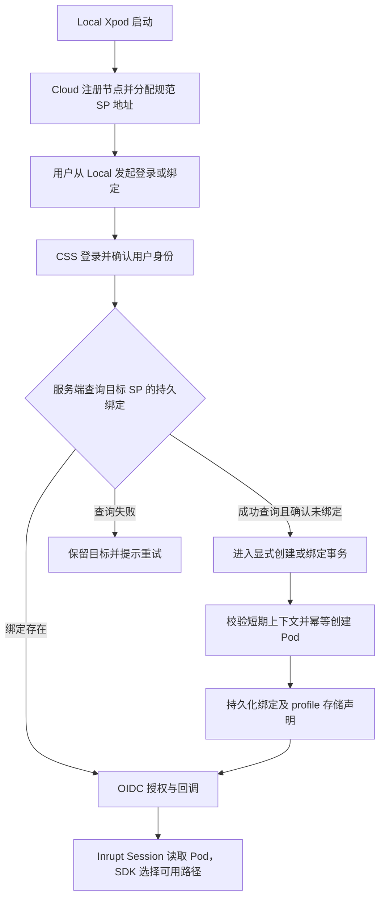

# Account 页面与 Local provisioning 状态机问题整理

日期：2026-09-05  
状态：问题记录与待实施设计；不代表线上修复或验收完成。

本文承接 [认证权限边界](2026-08-30-xpod-auth-authority-boundaries.md)，聚焦 Account 页面出现“存储空间未准备好”以及误请求 `/provision/status` 的问题。页面样式恢复另见 [Web 展示层清理计划](../plans/2026-09-05-account-web-presentation-cleanup.md)。本次仅整理问题，不继续修改状态机。

## 1. 当前现象与证据边界

- 用户在 Web 页面看到“存储空间未准备好 / 无法检查存储空间状态，请重试”，控制台存在发往 `pods.undefineds.co` 的 404 和 400。
- 只读检查确认 `https://pods.undefineds.co/provision/status` 返回 404；Account 页面入口仍返回 200。
- `ui/src/utils/pod.ts` 之前在浏览器环境无条件尝试 `/provision/status`。因此普通 Cloud Account 页面会向自身域名请求 Local Gateway 接口。
- 当前临时修补把条件收窄为 `rawPreferred || isLoopbackPage()`。这仍然使用缓存和浏览器主机名推断运行角色，不能作为最终设计。
- 照片没有完整请求 URL 和响应体，不能证明截图中的每一个 404 都来自上述接口，更不能把 400 一并归因。需补充对应请求及服务端日志。
- 此前 44 项 Account/Pod 定向测试及 UI 构建通过，只证明对应代码检查通过；没有证明真实 Cloud 登录、创建 Pod、绑定及后续重登全链路通过。

## 2. 必须分开的状态与所有者

| 状态 | 权威来源与所有者 | 生命周期 |
| --- | --- | --- |
| Account 登录态 | CSS 原生 Account Session | 登录、退出及 CSS 原生有效期 |
| WebID 登录态 | Inrupt Session 与 CSS OIDC | OIDC 登录、恢复、刷新、退出 |
| Local 节点注册与运行状态 | Local Xpod 与 Cloud 控制面 | 节点启动、注册、重连及维护 |
| 本次创建/绑定请求 | 服务端校验的 provisioning 上下文、当前 interaction 或显式创建事务 | 本次操作及其重试 |
| WebID 与 Storage 的持久绑定 | 服务端持久绑定记录及 profile 中相应存储声明 | 创建/绑定完成后持续存在，直到显式变更 |
| 存储可达性及最优路径 | SDK 路由发现与实际请求结果 | 可随网络、进程状态变化 |

节点注册成功不等于已经为某个用户创建并绑定 Pod。节点启动时可能还没有用户身份，用户绑定必须在获得相应身份和授权后完成。

`provisionCode` 是有期限的操作上下文。它可以限定本次创建/绑定的目标 SP，但其过期不能使已持久化的绑定失效。profile 中的公开存储声明也不能替代服务端对当前用户、节点及操作权限的校验。

## 3. 当前实现偏差

### 3.1 使用页面地址推断部署角色

`pod.ts` 和 `context/AuthContext.tsx` 中均有 loopback 判断。`localhost:5173` 可能只是 Vite 开发服务器；Local Xpod 也可能通过 LAN 或规范域名访问。因此主机名不能确定当前页面是否拥有 Local Gateway 能力。

应由宿主提供明确、可信的运行能力和 Gateway 连接信息。它们优先从已有运行上下文推导，不新增要求用户填写的环境变量。

### 3.2 临时缓存承担了事务和范围判断

`resolveProvisionCodeForCurrentScope()` 会从调用参数或单个 `sessionStorage.provisionCode` 槽读取上下文，再决定是否探测当前 origin 的 Gateway。缓存没有体现 interaction、目标节点、issuer 和事务结束边界。

这允许旧流程的上下文影响后续页面；在 Cloud 页面携带 Local code 也不意味着 Cloud 当前 origin 有 `/provision/status`。

### 3.3 短期凭据与长期绑定耦合

`currentStorageScope()` 从 provisionCode 推导目标存储；AccountPage、FirstPodPage、ConsentPage 均消费这一上下文。结果是短期 code 的刷新、失效或丢失可能影响“已有 Pod 是否就绪”的判断。

目标 SP 的身份和已完成的用户绑定需要持久来源。已完成绑定后的常规读取不应依赖旧 code。

### 3.4 请求失败与无上下文被合并

`fetchCurrentProvisionCode()` 对网络失败和非成功 HTTP 响应返回 `undefined`，调用方随后可能使用缓存或按无 provisionCode 继续。这样无法区分“不适用 Local provisioning”“Local 暂不可达”“上下文过期”。

已明确进入 Local 绑定事务后，请求失败必须保留目标和错误状态，不能自动转换为普通创建流程。读取 bindings 失败也不能解释为绑定不存在。

### 3.5 多处独立发现与回退

除 `pod.ts` 外，以下路径也包含 provisioning 或 Local 路由发现，修复单个函数不足以收口：

- `ui/src/context/AuthContext.tsx`：`resolveXpodAccountIndex()`。
- `ui/src/utils/account-control-url.ts`：`resolveHostedAccountControlUrl()` 在回退路径探测 `/provision/status`。
- `ui/src/solid/XpodSolidRuntime.ts`：`resolveXpodLoginContext()` 发起登录前查询状态。
- `ui/src/solid/xpod-local-route.ts` 与 `XpodOidcCallbackApp.tsx`：Local 路由及回调相关探测。

应逐一核对调用者的角色：明确的 Local 宿主可调用自己的 Gateway；CSS Account Web 控制器消费服务端上下文和 Account controls。

### 3.6 服务端也尚未完全解除耦合

`src/identity/oidc/ScopedPickWebIdHandler.ts` 当前使用 provisionCode 解析目标 SP；没有 code 时使用默认 storage base，过期 code 返回 400。`ReactAppViewHandler.ts` 已能把当前 OIDC interaction 上下文注入页面。

因此“删除前端探测”本身不够。还需明确后续登录如何以服务端可验证的目标 SP 身份选择已绑定 Pod，避免仍靠每次传入新的创建凭据维持 Local 选择。

## 4. 建议的状态流转

以下为拟实施约束。目标 SP 的持久表示、上下文传递及服务端接口需要结合现有实现进一步确定。

- 普通 Cloud/Standalone Web Account 页面通过 CSS controls 运行；它们不主动发现 Local Gateway。
- Local 宿主在发起需要 provisioning 的操作前取得有效上下文，由服务端验证并绑定到本次操作。URL 只是传输入口，前端解析结果不是授权依据。
- 当前服务端 interaction 优先于浏览器缓存。缓存最多保存与本次事务对应的短期恢复信息，不能成为跨事务的身份、模式或绑定来源。
- 已完成的绑定以持久记录恢复。已有绑定的正常登录不能因为创建 code 过期再次进入创建界面。
- 操作中 code 过期应返回明确的“当前操作上下文已过期”，由原 Local 宿主重新发起；如何保留已完成的 Account 登录由 CSS 原生行为决定。
- 部分完成、网络失败与确认未绑定分别处理。重试应复查持久结果，避免创建重复 Pod。
- SDK 路由优化只改变请求的传输路径；WebID、Storage URL 及 Pod 内资源标识保留 Cloud 分配的规范地址。

## 5. 待实施顺序

1. 明确并记录节点注册、用户绑定、存储可达性三个状态来源，以及 Local 宿主的能力输入。
2. 核对服务端 pick-webid 与 Pod 创建链：确定已绑定场景如何恢复目标 SP，确保不依赖过期创建 code。
3. 收口 Local 宿主的上下文获取；移除 CSS Web 页面对 `/provision/status` 的主动查询与主机名推断。
4. 将无上下文、过期、请求失败、未绑定、部分完成、已绑定拆为明确结果，删除静默回退。
5. 约束临时缓存的事务范围与清理时机，再调整页面错误文案。
6. 运行真实 Gateway 的完整验收并记录源码 SHA、模式、规范地址、实际请求路径与结果。

## 6. 必须覆盖的验收

| 场景 | 应有行为 |
| --- | --- |
| Cloud Web 普通登录/创建 | 不请求 Local `/provision/status`，使用 CSS controls |
| Standalone Web 创建 | 遵循该部署的 CSS 配置，不因 localhost 被推断为 Local+Cloud |
| Vite 代理上述任一模式 | 与实际宿主能力一致，不根据端口或域名猜测 |
| Local 首次绑定 | 目标为指定节点，成功持久化规范 Storage 地址 |
| Local 已绑定后重登，旧 code 已过期/删除 | 从持久绑定恢复，无重复创建步骤 |
| 已明确 Local 目标，但 Gateway/Cloud 请求失败 | 保留目标，显示可重试错误，不切换默认存储 |
| 两个 Local 节点先后从同一 Cloud 页面发起 | 目标和事务不串用 |
| 创建请求超时但服务端已完成 | 重试复用已有结果，不重复创建 |
| Local 离线但绑定仍存在 | 表达可达性失败，不声称绑定丢失 |
| 浏览器重载、退出、取消或事务完成 | 临时上下文按事务清理，不污染后续流程 |

验收需分别报告 Account 登录、Inrupt 登录、Pod 读写和 Chat；页面测试或 UI build 不能替代真实链路证据。

## 7. 当前仍待确定

- 截图中 400 的完整路径、响应及服务端异常；过期 provisionCode 是代码中存在的一种 400 原因，尚不能认定就是截图原因。
- 哪个现有可信宿主输入可直接提供 Local Gateway 能力，以及后续登录目标 SP 的稳定标识。
- 创建部分完成时，服务端绑定记录、profile 与目标 SP 的幂等恢复约定。

在上述链路核验前，不把 loopback 条件或此前的 44 项定向测试作为状态机已修复的结论。
