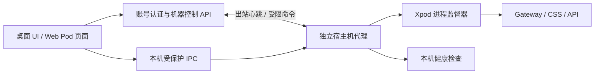

# Xpod 登录、身份与宿主/Pod 生命周期设计（canonical）

> **状态：2026-09-19 canonical（合并版）。** 本文件是 Xpod 登录、身份与 Pod 生命周期的唯一设计来源，
> 由原先两份文档合并而成：认证面（登录、状态、链路、失败隔离、验收契约）与运行面
> （宿主代理、服务、显式 Pod 创建、自部署校验、实施台账）。
>
> **分层**：权威**边界**的完整决策记录仍是
> [2026-08-30-xpod-auth-authority-boundaries.md](2026-08-30-xpod-auth-authority-boundaries.md)
> （含 API / applet / Gateway 等非登录面）。本文件把其中**登录相关**条款收为规范陈述；
> 两者冲突时，登录面以本文件为准，非登录面以该文件为准。
>
> **逐条"文档 vs 代码"的裁决过程与待办**见
> [../../testing/login-design-drift-register.md](../../testing/login-design-drift-register.md)。
>
> **本轮性质：只对齐、不改行为。** 本文件既描述"设计应为"也记录"实现现状"，
> 两者不一致处一律显式标注为**偏离**并登记待办，不靠改文档把缺陷写成正确。
>
> **章节编号按部分独立**：第一部分为 0–9，第二部分为 1–11。跨部分引用一律写明"第一部分/第二部分"。

---

# 第一部分：认证面（登录与身份、状态与验收契约）

## 0. 与第二部分的关系

**第二部分**负责运行面与显式 Pod 创建编排，尚未实现。**本部分**负责登录与身份，八态清单仍以 §3.3 为唯一来源；两部分仅在 Pod 创建编排处交界，该处目标流程以第二部分为准。

局部调整涉及本部分 §3.3 的创建入口和 §6 L-2：注册只创建 Account，Pod 管理页显式创建后再续接授权。§2、§3.1/§3.2、§3.7、C-1…C-6、§7、§8 继续有效。当前 X-1 的切号隔离约束和 D-13 的多 Pod 选择缺口也继续有效，不能因移除自动创建而注销；旧证据不代表新流程已通过。

## 1. 口径（先对齐术语）

设计讨论中反复出错的根源是几个词被当成同义词。以下为唯一口径。

| 术语 | 含义 | **不是** |
| --- | --- | --- |
| **Account** | CSS 账户会话（`/.account/*`、`css-account` cookie、CSS controls） | 不是 Pod 权限，不是 WebID 身份 |
| **WebID** | Inrupt/OIDC 会话（浏览器 OIDC state/PKCE/DPoP、access/refresh token、`session.fetch`） | 不是账户会话，不能从 Account 就绪推断 |
| **Pod 就绪** | 精确 `WebID × storageUrl` 配对已确认，且**实际鉴权读写命中该 Pod** | 不是"发现到公开 profile"，不是 `/v1/models` 成功 |
| **登录** | 获得上述某一层身份的**泛指**口语词 | 本设计**不使用**"已登录"这个合成词；必须说清是哪一层 |
| **记住账号** | CSS 决定账号 cookie 是否持久 | 不是凭据；不是"记住应用" |
| **记住应用** | IdP 对该 client + WebID + 权限范围的 grant 复用 | 不是账号 cookie，不是 SDK 会话 |
| **展示记录** | 已记住邮箱/头像等公开提示 | **永远不是**认证证据 |
| **身份键** | WebID 的**完整原始字符串**（协议、域名、端口、全部路径、query、fragment） | 不是 `URL.href`、不是去端口/去 fragment/小写化后的值 |
| **登录事务** | 一次 WebID 授权在宿主侧的 state/PKCE/returnTo 记录（sessionStorage，per-tab） | 不是 OIDC interaction，不是 SDK 会话 |

身份比较的硬约束：不同原文**不得**自动合并；只有同一原文才允许复用绑定。
此约束贯穿 Pod 查找、所有权与角色解析、provision 链接复用、授权选择、登录事务与记住登录。
存储地址与 issuer 的地址规范化是**另一件事**，不得用身份比较规则代替。

## 2. 权威与边界（登录相关规范陈述）

1. **CSS 拥有 Account 会话。** Xpod 不新增 Account 会话、不实现第二套登录/刷新/登出语义。
2. **Account cookie 的生命期由 CSS 决定，Xpod 不延长也不缩短。**
   前端只在 cookie 与当前 token 不一致时才写入；不重写 CSS 已下发的持久 cookie。
   跨域 JSON 登录保留一个**会话级**本地桥接副本，它不复制服务端有效期、不擅自延长登录，
   且 token 绝不落入 localStorage/sessionStorage。**Xpod 不对 cookie 做拓展或增强。**
3. **Inrupt 拥有 WebID 会话。** 每个浏览器 document 一个 `Session`；不使用第二份认证事实。
4. **Pod 绑定是 provisioning，不是第三种认证。** WebID profile 与 Solid 授权是权威；
   Pod 缓存只是性能提示。
5. **失败隔离**：任一层失败只改变它自己的状态。Account 失败不得注销有效 WebID；
   Pod 资源 401/403/404/500 只是资源操作失败，不得改变 Account/WebID 会话状态。
6. **禁止**：以 Account 凭据换取 WebID 权限；把 Account token 当 Solid principal；
   把展示记录当凭据；用身份归一化合并不同 WebID 原文。

## 3. 状态清单

统一口径为 **认证面三权威（Account / WebID / Pod），运行面两权威（宿主 / 服务）**。本节定义认证面三层状态，不合成额外会话；Pod 绑定不构成第三套认证会话。运行面由宿主生命周期设计负责，外部可达性只是带时效的观测，不增加权威数量。

### 3.1 Account（CSS 投影） — 4 态

> **2026-09-19 与用户对齐确认（第一组）**：取 4 态方案。`error` 必须是**独立状态**，
> 界面显示"服务暂时不可用，请重试"，**绝不能显示成"未登录"**。

| 取值 | 含义 | 定义位置 |
| --- | --- | --- |
| `initializing` | 尚未取得可信 controls | `ui/src/context/AuthContextValue.ts:6` |
| `anonymous` | **已验证**为未登录 | `:7` |
| `authenticated` | 当前 authority 返回了该账户的 controls | `:9` |
| `error` | 失败，且**不得**当作匿名 | `:10` |

**已确认的两条规则**：

1. **Account 层没有"过期但知道是谁"这个权威状态。** CSS 在会话过期后只返回未登录，
   不提供"刚才是谁"。`anonymous` 可以携带一个**非权威的展示记录**
   （`RememberedXpodAccount`：displayName/username/avatarUrl + 待填邮箱），
   用于回填与展示，且必须按 issuer 校验后使用（`ui/src/auth/xpod-remembered-login.ts:170-176`）。
   **不得**为它新增状态——一旦分叉，消费方就会写出"没登录但知道是谁"这类分支，
   把展示记录当弱认证。
2. **`submitting` 不属于本层。** 提交态属于表单（登录/注册/找回/重置各有自己的节奏），
   把它塞进 Account 权威会把表单细节泄漏进权威层。当前类型成员
   `AuthContextValue.ts:8` 无生产者，`AccountAuthBoundary.tsx:39` 的分支悬空——
   处置为待办 D-02。

> **偏离 D-03**：设计要求 `error` 与 `anonymous` 严格区分，实现把瞬时 502/503/504
> 折叠进 `error` 或 `initializing`（`ui/src/context/AuthContext.tsx:53-57`），
> 且 `ConsentPage.tsx:641`、`ProtectedRoute.tsx:21` 把 `!isLoggedIn`（含 error）当未登录。
> 已登记待办。

### 3.2 WebID（Inrupt/SDK） — 5 态

> **2026-09-19 与用户对齐确认（第二组）**：5 态全部保留。

| 取值 | 含义 | 触发 | 定义位置 |
| --- | --- | --- | --- |
| `loading` | 初始化/恢复中 | 页面加载、`initialize()` | `ui/src/solid/XpodSolidRuntime.ts:32` |
| `anonymous` | 无可信会话 | 明确无会话、登出 | `:33` |
| `authenticated` | 有 `webId` | OIDC 完成 / 恢复成功 | `:34` |
| `expired` | 曾有效，已过期（保留 `webId`） | Inrupt `SESSION_EXPIRED` 事件 | `:35` |
| `error` | 明确失败 | 初始化失败、`ERROR` 事件 | `:36` |

**已确认的三条规则**：

1. **`expired` 保留，不并入 `anonymous`。** 它不是展示变体：由 SDK 的**权威事件**
   `SESSION_EXPIRED` 驱动（`packages/solid-sdk/src/session.ts:212`），且 UI 已有专属分支与文案
   （`ui/src/solid/WebIdAuthBoundary.tsx:236-238, 248-251`）。折叠会混淆"过期"与"从未登录"，
   而二者恢复动作不同（过期可先尝试静默恢复，从未登录必须走完整登录）。
2. **续期有意不建模。** SDK 只订阅 `LOGIN / LOGOUT / SESSION_EXPIRED / ERROR`，
   **不订阅 `SESSION_EXTENDED`**；并有测试明确要求"续期更换签名密钥时，已发出的鉴权绑定
   必须仍然有效"（`packages/solid-sdk/test/session.test.ts:439-455`）。
   即续期**不得**让 UI 抖动、**不得**让已发出的能力失效。
   **已接受的代价**：续期卡住时 UI 不可观测，只能等它最终变为 `expired`。
3. **WebID 侧的"没登录但知道是谁"= 展示记录，不是状态。** 即 remembered WebID login
   （displayName / 头像 / WebID / Pod），用于"上次是你，继续吗"。它可出现在 `anonymous` 与
   `expired` 之上，但不改变状态本身，也**不得**作为凭据——与 §3.1 第 1 条同规则。

> **口径修正 D-04**：旧文档写作 `initializing`，代码为 `loading`。本设计以代码取值为准，
> 并把"三源命名统一"登记为待办。

### 3.3 存储 / Pod（宿主 + SDK） — 8 态

**旧文档没有这一层的状态清单；这是本次补齐的部分。** 本节也是宿主生命周期页面引用的唯一 Pod 状态定义；“不可访问”“需要修复绑定”是原因/操作提示，不是新增枚举。

**创建入口变更提案（尚未实现）**：`creating` / `waiting_for_binding` 仅用于 Pod 管理页显式创建及既有任务恢复，不再作为注册/登录/授权的必经步骤。以下代码现状与 D-13 保留，不能将提案当作已修复。

| 取值 | 含义 | 定义位置 |
| --- | --- | --- |
| `loading` | 枚举绑定中 | `packages/solid-sdk/src/storage-selection.ts:5` |
| `empty` | 无任何绑定 | `:6` |
| `selecting` | 多候选，**必须由用户显式选择** | `:7` |
| `creating` | 正在创建首个 Pod | `:8` |
| `waiting_for_binding` | 已下单，等绑定出现 | `:9` |
| `ready` | 精确配对已确认 | `:10` |
| `conflict` | 选中项与当前身份/会话不一致 | `:11` |
| `error` | 打开失败 | `:12` |

**必须同时成立的规则**：
- 只有**唯一**候选时允许自动 `ready`（`ui/src/auth/xpod-storage-selection.ts:79-85`）；
  多候选一律进入 `selecting`，不得静默取第一个。
- `ready` 要求 `WebID` 与 `storageUrl` 同时精确匹配，且与 SDK 会话公布的 Pod 一致
  （`ui/src/solid/WebIdAuthBoundary.tsx:296-301`）。
- **偏离 D-13**：`selecting` / `empty` / `creating` 只在 Consent 链路可达；
  直接登录/静默恢复链路（`WebIdAuthBoundary`）的 `storageSelectionState` 只能返回
  `waiting_for_binding / ready / conflict / error`，且失败原因被压成通用文案
  `无法打开选中的 Pod，请重试。`。多 Pod 用户在该链路**没有显式选择出口**。已登记待办。

### 3.4 产品退出协调 — 3 态

| 取值 | 含义 |
| --- | --- |
| `idle` | 未在退出 |
| `running` | 进行中，带 `step: 'solid' \| 'account'` |
| `error` | 某一层失败，只重试失败层 |

实现：`ui/src/auth/xpod-product-logout.ts:17-21`。
**已成功的层不因重试重复执行**（`solidCleared`）。两层都确认后才 `idle`。

> **偏离 D-14**：文档只定义了"重试"语义。**新的**退出调用（非 retry）会重建 operation、
> 把 `solidCleared` 重置并丢弃在途 `onComplete`；"退出处于 error 态时用户改点切换账号"
> 走哪条语义**未定义**。已登记待办。

### 3.5 登录事务与回调失败码

**事务状态**：`XpodLoginTransaction`（sessionStorage，per-tab），错误码见
`ui/src/auth/xpod-login-transaction.ts:19-27`。

**回调失败码共 18 个**（旧文档 `docs/` 零命中；这是本次补齐的安全契约）：

| 来源 | 码 |
| --- | --- |
| 协议层（10） `packages/solid-sdk/src/webid-auth.ts:57-67` | `missing-transaction`、`replayed-transaction`、`expired-transaction`、`malformed-transaction`、`oidc-state-invalid`、`oidc-provider-error`、`unauthenticated`、`unsafe-route`、`unsafe-return-to`、`redirect-failed` |
| 存储层（8） `ui/src/solid/XpodOidcCallbackApp.tsx:38-46` | `missing-storage`、`provision-status-unavailable`、`local-binding-missing`、`webid-mismatch`、`binding-mismatch`、`profile-read-failed`、`pod-open-failed`、`storage-unavailable` |

**三分处置**（决定"哪些失败可以悄悄重试、哪些必须让用户重新授权"）：

| 处置 | 码 | 语义 |
| --- | --- | --- |
| **可重试**（保留已兑换身份，原地重跑存储/Pod 步骤，**不重新兑换 code**） | `provision-status-unavailable`、`profile-read-failed`、`pod-open-failed` | `XpodOidcCallbackApp.tsx:69-71` |
| **自动重置**（清本地事务与回调缓存，从授权重新开始） | `webid-mismatch`、`binding-mismatch` | `:76-79` |
| **终止**（其余 13 个） | 剩余全部 | 返回登录入口，不放宽任何绑定校验 |

**不变量**：code 只兑换一次；拒绝异常时不用新 client 去兑换旧 code；
未验证的响应不得改变身份、Pod 绑定或完成另一笔待处理事务。

### 3.6 展示记录（非权威）

已记住邮箱/头像仅用于回填与展示。**不得**作为会话、授权或恢复的证据。

### 3.7 服务不可达（跨层，2026-09-19 对齐确认）

**已定：启动/唤醒本地服务是宿主能力，不属于登录流程。**

依据（架构性，而非分工偏好）：登录界面本身由该身份服务提供——壳一律 `loadURL(targetUrl)`
（`desktop/src/main.ts:203/272/307`），且宿主的"可达"判据就是该服务可用
（`desktop/src/runtime-manager.ts:185-199` 探 `/service/status` 的 `css`+`api`、
`/status/overview` 与 `/.account/`）。**服务不在时，页面出不来，登录流程根本不存在。**

因此真实场景只有一种：**页面已加载后服务消失或正在重启**。它的正确处理是"等它回来 + 重载页面"，
属**宿主窗口生命周期**，宿主已具备该策略：

| 宿主能力 | 位置 | 关键点 |
| --- | --- | --- |
| `ensureRunning()` / `waitUntilReachable()` / `restart()` / `stopOwned()` | `desktop/src/runtime-manager.ts:67/118/89/127` | `ownership` 三态 `none \| desktop \| external` |
| 失败加载后恢复 | `desktop/src/main.ts:385-403` | **等已经在起来的运行时，不启动竞争实例**；超时 **10 分钟** |
| 可达探测 | `runtime-manager.ts:185-199` | 1.5s 单次超时，250ms 轮询，默认 60s（恢复路径用 10 分钟） |

**登录流程在该窗口内只承担三条职责**（都不是新身份状态）：

1. **识别**：服务不可达 **≠** 未登录。不得因此清除有效会话。
2. **不误判**：服务不可达 **≠** 需要用户重走授权。不得因此丢弃一次已获得的授权。
3. **保序**：已完成步骤不重来（authorization code 一次性）。

实现上表现为**一个跨层的失败分类**："服务不可达（可能正在启动）" 与 "服务出错（真失败）"
必须可区分，因为二者的正确动作不同（等待/交宿主 vs 重试/放弃）。

**纯浏览器指向 Managed Local：不专门设计。** 服务没起则页面打不开；页面已加载则刷新即可。

**待定的产品体验项**（不阻塞状态对齐）：服务启动期间用户看到什么。
现状是 Electron 的加载失败页（最长 10 分钟），而那时**页面不是 Xpod 的页面**，
所以只能由 Electron 层渲染，例如"正在启动 Xpod…"与手动按钮。记为 Q-3。

## 4. 组合规则（取代原单机状态图）

旧文档用一张单机 `stateDiagram` 描述登录，其中 12 个状态名有 11 个在代码中零命中，
无法对照检验。本设计改为**三源组合表**：产品状态 = 三个权威状态的有序组合。

### 4.1 合法组合（必须支持，且各有独立出口）

| # | Account | WebID | Pod | 必须的行为 |
| --- | --- | --- | --- | --- |
| C-1 | authenticated | anonymous | — | Status/Dashboard 可用；不得读私有 Pod |
| C-2 | anonymous | authenticated | ready | applet/Pod 可用；用户卡可退出、可切换 |
| C-3 | anonymous 或 error | authenticated | unavailable | 保留 WebID 与 Pod，只重试 Pod 层 |
| C-4 | authenticated | authenticated | ready | 全功能 |
| C-5 | authenticated | expired | — | 可重新授权；Account 不受影响 |
| C-6 | anonymous | anonymous | — | 登录入口 |

### 4.2 非法组合（不得出现；每一条都应能指出由谁阻止）

| # | 组合 | 阻止方 |
| --- | --- | --- |
| X-1 | Account 已切换，Pod 仍报 ready 且指向旧 WebID | 产品切换必须先清理旧 WebID/Pod（**偏离 D-15：Consent 页切号未清 WebID**） |
| X-2 | WebID 已登出，却因迟到回调恢复为 authenticated | 事务代际守卫 + 回调单次兑换（SDK 层无 logout epoch，见 D-16） |
| X-3 | 退出未完成，却显示"已退出" | 退出协调器只在两层都确认后 idle |
| X-4 | 多候选 storage 被静默选中 | 仅唯一候选允许自动 ready |
| X-5 | error/unknown 被当作 anonymous | 设计要求如此；**实现未完全满足**（D-03） |

### 4.3 三源不是同一个东西

`Account authenticated` **不是** WebID 授权的前提（ai-connections 直接用 WebID）；
`WebID authenticated` **不保证** Pod ready；`Pod ready` 也**不**证明 Account 身份。
任何"整体已登录"的布尔推断都属于违反本设计。

## 5. 转换矩阵

| 层 | 转换 | 触发 | 守卫 | 证据 |
| --- | --- | --- | --- | --- |
| Account | `initializing → authenticated/anonymous` | controls 探测 | generation + token 快照 | `ui/src/auth/AuthContext.test.tsx:222/247/274` |
| Account | `→ error` | 探测失败 | 不当作匿名 | `:628/680` |
| Account | `error → retry` | 用户重试 | — | `:326-336` |
| Account | `authenticated → anonymous/error` | 登出 | 先 bump generation | `:368-386` |
| WebID | `loading → anonymous/authenticated/expired/error` | SDK 初始化 | `identityOperationGeneration` | `packages/solid-sdk/test/session.test.ts:33/76/178` |
| WebID | `→ expired` | token 过期 | — | `:286` |
| 存储 | `loading → empty/selecting/ready` | 绑定枚举 | 唯一才自动 ready | `ui/src/auth/xpod-storage-selection.test.ts` |
| 存储 | `→ creating → waiting_for_binding → ready` | 首 Pod 创建 | Account token 快照守卫 | `ui/src/utils/consent-first-pod.guard.test.ts`(24) |
| 存储 | `→ conflict/error` | 配对不符 / 打开失败 | 不得回落为登录失败 | `ui/src/solid/WebIdAuthBoundary.test.tsx:174-193` |
| 退出 | `idle → running(solid) → running(account) → idle` | 产品退出 | 只重试失败层 | `tests/e2e/shared-login.spec.ts:1345-1420` |

**转换测试缺口**（登记，不在本轮修）：`creating` / `waiting_for_binding` 两个状态在测试文件中出现
**0 次**（按 `status: '<state>'` 检索）；没有任何测试对着转换逐条映射。

## 6. 链路清单

每条链路必须定义：入口、**全部**成功出口、**全部**失败出口、取消点、幂等/重放立场。
未定义"取消点"或"失败出口"的链路视为设计未完成。

| # | 链路 | 入口 | 失败出口 | 取消 | 幂等/重放 | 证据 |
| --- | --- | --- | --- | --- | --- | --- |
| L-1 | Account 密码登录 | `/.account/login/password/` | 403 + 无认证产物；controls 未确认不产生会话 | — | 重复提交禁用 | `tests/http/ServerLogin.integration.test.ts`(12) |
| L-2 | 注册 → Account 管理 → 显式创建 Pod → consent → 原 app（目标提案） | applet/账号页 | 名称冲突、缺绑定、清单不可用各自可恢复 | 可取消创建前流程或授权；取消等待不撤销已提交任务 | 显式创建幂等，超时先恢复任务 | 旧自动创建证据：`consent-first-pod`(18)+`guard`(24)；新流程待验收 |
| L-3 | 忘记/重置密码 | `forgot/` | 一次性 token 重放/篡改/过期拒绝 | — | 记录一次性消费 | `PasswordRecovery.integration.test.ts`(1) |
| L-4 | WebID authorize → consent → callback → Pod | 受保护页面 | 见 §3.5 三分处置 | 有 | code 单次兑换 | `shared-login.spec.ts`(38) |
| L-5 | applet 发起（内置） | `solid.requireLogin` | **偏离 D-17：无失败/取消信号** | 有 | — | `ui/src/extensions/ai-connections-host.test.ts` |
| L-6 | applet 发起（独立 origin） | 外部 host | 拒绝授权、state 篡改 | 有 | 不消耗其它 pending | `external-applet-login.spec.ts`(5) |
| L-7 | 会话恢复 / 续期 | 页面加载 | 过期 → 重登 | — | 恢复幂等 | `browser-session-refresh.spec.ts`(2) |
| L-8 | 静默恢复（reload） | 同 document | 失败不无限重试 | — | `prompt=none` | `inrupt-session-restore.test.ts:46` |
| L-9 | 切换账号 A→B | 用户卡 / Consent | 登出失败必须报告未完成 | — | 旧异步不得覆盖 B | `ConsentResume.test.tsx`（本轮新增 2 项） |
| L-10 | 产品退出（含部分失败） | 用户卡 | 只重试失败层 | **偏离 D-18：无取消点** | 已成功层不重复 | `shared-login.spec.ts:1345-1420` |
| L-11 | interaction 取消 | consent 页 | 取消失败可重试 | — | 不消耗其它 interaction | `consent-recovery.spec.ts`(7) |
| L-12 | 回调失败/重放 | `/auth/callback` | §3.5 三分处置 | 有 | 同 code 不重复兑换 | `XpodOidcCallbackApp.test.ts`(46) |
| L-13 | 桌面 关窗/托盘/重启 | Electron | 原生取消、第二实例唤回 | 有 | 托盘同 document | `desktop-login-lifecycle.spec.ts` |
| L-14 | CLI 密码登录/登出 | `xpod auth` | 退出码 2 = `auth_required` | — | — | `CliPasswordLogin.integration.test.ts`(1，`skipIf` 门控) |
| L-15 | API Key 凭据 | `/v1/*` | 401；撤销后立即失败 | — | 错误 secret 不复用缓存 | `tests/api/ClientCredentialsAuthenticator.test.ts`(6) |

> CLI **没有**浏览器登录命令；不得把 helper 发起 OIDC 称为 CLI 浏览器登录。

## 7. 失败隔离矩阵

| 失败 | 允许改变 | 必须不变 |
| --- | --- | --- |
| Account anonymous/expired | 仅 Account 状态 | WebID 会话 |
| Inrupt 恢复/回调失败 | 仅 WebID 状态 | Account 会话 |
| Pod 资源 401/403/404/500 | 该资源操作 | Account 与 WebID 会话状态 |
| 本地 Network API 失败 | 该页面 | Account 与 WebID 会话状态 |
| Gateway/API 进程不可用 | 受影响请求/健康 | Account 与 WebID 会话状态 |
| 显式 Account 登出 | CSS Account | 当前 document 的 Inrupt 会话 |
| 显式 WebID 登出 | Inrupt 会话 | Account（除非用户另选整体退出） |

## 8. 验收契约

### 8.1 分层证据（不得互相冒充）

| 层 | 命令 | 替身边界 |
| --- | --- | --- |
| 单元 | `bun run test`（含 `ui/src/auth`、`ui/src/solid`、`tests/identity`、`tests/authentication`） | mock/stub；不证明真实服务可用 |
| SDK | `bun run --filter '@undefineds.co/solid-sdk' test` | 内存状态 |
| 隔离集成 | `bun run test:integration`（lite + full） | 启动脚本使用 fake QLever；lite 的 Chat 为 mock |
| 浏览器 E2E | `test:integration:auth`、`test:integration:auth:matrix` | 故障用例注入 503/拦截响应；夹具 ≠ 当前部署 |
| 权威边界浏览器验收 | `bun run auth:accept:browser`（5 条 `@auth-boundary`） | 真实一次性 CSS/OIDC 夹具 |
| 当前实例 | 手工/脚本连接运行中的 Gateway | 正常链路未替换认证与 Pod |

**已知门禁缺口**（登记，不在本轮修）：
- `candidate.yml`（发布分支唯一 workflow）**不跑** `bun run test`；`ci.yml` 只在 `main` 触发。
- `auth:accept:browser` **不在任何 CI**。
- `tests/e2e/**` 与 `desktop/test/**` 被 `vitest.config.ts` 排除，且无 CI job 执行后者。
- `tests/http/ServerLogin.integration.test.ts` 默认 12 项全跳过（由 lite 纳入后才真实执行）。

### 8.2 每格都要可追溯

原"18 格"矩阵是叙述性归纳（无测试带格子编号，12 格由 6 条参数化用例代表）。
本设计要求：**每个检查点必须有编号**（§4.1 的 C-1…C-6 × 部署），
且对应测试在名称或注释中标注该编号。

### 8.3 报告纪律

- 分别列出正常真实链路、故障注入、替身测试；不得合并称为"全部真实集成"。
- 跳过不计为通过。文档中的历史计数是**当时快照**，引用前必须重跑或标注未复现。
- 禁止记录密码、token、PKCE verifier 或完整 provisionCode；只保留存在性/状态码。

## 9. 未决与偏离（待办）

### 9.0 尚未对齐的设计问题（需用户裁决，未定不入规范）

| ID | 问题 | 现状 |
| --- | --- | --- |
| **Q-1** | ~~本地身份服务未启动时，唤醒是否并入登录流程？~~ | **已定（2026-09-19）：启动/唤醒是宿主能力，登录流程不持有。** 详见 §3.7。 |
| **Q-2** | 多标签隔离依赖上游（Inrupt + Web Locks），且 Inrupt 的孤儿清扫正则匹配不到 `xpod.inrupt.*` 前缀 | 前缀是为对抗 Inrupt 3.1.1 "登录时全局清除标准 OIDC 键"而加的（`XpodSolidRuntime.ts:219-220`），移除会破坏多标签并发登录。待议：是否把该依赖写成契约并补可断言回归。 |
| **Q-3** | 服务启动期间的用户可见性：现状是 Electron 加载失败页，最长 10 分钟 | 页面此时不是 Xpod 的页面，只能由 Electron 层渲染（如"正在启动 Xpod…" + 手动按钮）。产品体验项，不阻塞状态对齐。 |

以下为**设计已明确、实现尚未满足**的偏离，按优先级：

| ID | 偏离 | 处置方向 |
| --- | --- | --- |
| D-03 | 无 `unknown` 态，瞬时失败被当 `error`/`initializing`；`error` 在 Consent/ProtectedRoute 被当匿名 | 新增 `unknown` 态或让消费方显式区分 error |
| D-13 | 多 Pod 在直接登录链路无显式选择出口，原因被通用文案压平 | 补选择出口或明确"去账号页选择"的放弃出口 |
| D-14 | 退出：新调用 vs 重试的语义未定义 | 定义覆盖/合并语义与 `automaticLoginBlocked` 复位时机 |
| D-18 | 产品退出无取消点 | 定义放弃语义 |
| D-17 | applet `requireLogin()` 无失败/取消信号 | 扩展返回契约 |
| D-02 | Account `submitting` 无生产者，UI 分支悬空 | 由表单驱动该状态，或从类型移除 |
| D-15 | Consent 页切号不清 WebID/Pod | 切号前清理或明确保留理由 |
| D-16 | SDK 无 logout epoch，迟到回调可让底层重新登录 | 引入 logout epoch |
| D-01 | 转换测试缺口：`creating`/`waiting_for_binding` 零覆盖 | 补状态级测试 |
| D-04 | 三源状态命名不一致（`initializing` vs `loading`） | 统一命名 |
| D-05 | 回调失败码无文档 | **本轮已补入 §3.5** |
| D-19 | `candidate.yml` 不跑单元套件；`auth:accept:browser` 不在 CI | 纳入门禁 |

（逐条"文档 vs 代码"的裁决过程见
[`../../testing/login-design-drift-register.md`](../../testing/login-design-drift-register.md)。）

### 9.1 独立待办的交付排期

以下五项不阻塞宿主生命周期设计的首期解耦，仍须独立关闭。这里规定交付顺序与负责模块，不承诺未经估算的日历日期；Q 项仍须先定案再实施，不因排期自动成为已定规范。首期结束后先处理身份隔离，再补选择出口和 SDK 契约；Q-3 随第二期宿主工作交付。

| ID | 排期 / 负责模块 | 关闭条件 |
| --- | --- | --- |
| D-15 | 首期后身份修复批次，优先；Consent / 退出协调 | 定案切号清理顺序，验证 A→B 不沿用旧 WebID/Pod；清理失败可恢复，迟到响应不覆盖新身份 |
| D-03 | 同一身份修复批次；Account 状态消费者 | 按 §3.1 四态契约先区分 error 与 anonymous，覆盖断网/瞬时失败及恢复；是否新增 unknown 另行裁决，不在局部模块私增状态 |
| D-13 | 随后选择流程批次；WebIdAuthBoundary / 共享选择视图 | 直接登录与静默恢复的多 Pod 候选可显式选择、返回或取消；不默认取第一个，错误原因可辨识；三模式与 applet 入口回归 |
| Q-2 | 同期 SDK 契约批次；XpodSolidRuntime / SDK 适配 | 先明确 Inrupt/Web Locks 依赖及 `xpod.inrupt.*` 前缀、清扫责任与兼容策略；再以多标签并发、回调隔离和孤儿清理测试证明，不盲删前缀 |
| Q-3 | 第二部分 §8 第 3 步；Electron 本地控制页 | 先确定启动中、超时、失败的文案与操作；Gateway 未就绪也可显示状态、重试或取消等待，取消等待不等于停止服务；真实桌面冷启动验收 |

“不阻塞首期”只限定本次解耦的交付范围，不豁免既有身份隔离契约；首期引入的新回归仍须当期修复。上述项未关闭时，报告必须保留缺口，不能宣称所有登录场景已通过。

---

# 第二部分：运行面与 Pod 编排（宿主代理、显式创建、实施台账）

日期：2026-09-19。状态：设计提案，尚未实现。本文基于当前开发工作区；不代表已发布的 0.4.10 已具备这些能力。

## 1. 决策摘要

1. 创建 Account 只创建账号，不隐式创建 Pod；账号登录成功不依赖 Pod 就绪。
2. 创建、绑定、查看及迁移 Pod 的用户入口统一到 Pod 页面。授权页只选择明确绑定且就绪的 Pod。
3. 独立宿主机代理负责机器身份、心跳和 Xpod 生命周期；Xpod 停止后代理仍可工作。
4. 桌面 UI 是代理的控制客户端，关闭窗口不停止代理。显式停止 Xpod、退出代理和卸载是不同操作。
5. 远程“启动 Xpod”只适用于代理在线的机器。关机、休眠、代理未运行不能靠普通心跳唤醒，不承诺远程开机。
6. 既有 Account、完整 WebID、Pod URL、nodeId、数据目录必须保留；不通过重建 Pod 完成迁移。

### 1.1 与第一部分的分层及覆盖范围

**第一部分**继续作为登录状态、转换、失败隔离与验收契约的权威；**本部分**负责宿主与 Pod 生命周期。两部分的流程覆盖交界仅为 **Pod 创建编排**：本部分将注册/登录/授权中的隐式创建迁到 Pod 管理页的显式操作，不替代第一部分。

| 第一部分章节 | 本次处理 |
| --- | --- |
| §2、§3.1/§3.2、§3.7、§4 C-1…C-6、§7、§8 | 继续有效；服务不可达不改变身份，两层会话及失败隔离不变 |
| §3.3 | 保留唯一八态定义；仅改变 `creating` / `waiting_for_binding` 的触发入口，不另建 Pod 生命周期枚举 |
| §6 L-2 | 目标流程改为注册成功 → Account 管理 → 用户显式创建 Pod → 授权续接；既有测试证据不能证明新流程通过 |
| §4 X-1 | 当前条目是切号后沿用旧 WebID/Pod 的非法组合，继续有效；只移除与其相关编排中隐式创建的假设，不退休该约束 |
| §3.3 / §9 D-13 | 自动创建相关路径说明随入口迁移修订；多 Pod 缺少选择出口仍是独立待办，不能随迁移关闭 |

以上为目标设计变更，尚不代表代码已实现；旧实现偏离和历史验收记录保留。

## 2. 当前问题与目标边界

当前 Local 首次使用把账号认证、Local 存储准备、Pod 创建和应用授权串在一起，失败时难以判断是身份、宿主机还是存储问题。应让用户在账号登录后就能管理机器，并在明确选定存储位置后创建 Pod。

现有 Managed Local 的 CLI `src/cli/commands/start.ts` 在父进程启动 `EdgeNodeAgent`，退出时停止；CSS 的 `EdgeNodeAgentInitializer` 另有装配入口，默认关闭。两者都不是独立宿主服务。桌面 `main.ts` 与 `runtime-manager.ts` 已有运行时管理能力，但这不等于拥有独立于桌面/Xpod 的常驻代理。

本次设计不引入第二套认证系统，不改写 Solid WebID，不重做证书、隧道或服务监督逻辑。优先提取和复用已有实现，不新增依赖作为默认前提。

## 3. 身份与状态模型

| 对象 | 职责 | 不代表什么 |
| --- | --- | --- |
| Account | 管理账号、机器及 Pod 操作权限 | 不代表已经取得某个 WebID 的应用会话 |
| WebID | 完整原始 URL 标识的身份 | 不按域名、路径后缀、Account 或单 Pod 情形归并 |
| 宿主机 | 经过绑定验证的运行位置 | 在线不代表 Xpod 或 Pod 可用 |
| Xpod 实例 | Gateway/CSS/API 等服务进程 | 进程存在不代表服务健康 |
| Pod | 明确归属、位置及访问地址的存储空间 | 目录存在或账号关联不能证明 owner |

口径统一为 **认证面三权威（Account / WebID / Pod），运行面两权威（宿主 / 服务）**。这里的五个权威是各自事实的所有者，不是五套认证会话：Account 由 CSS 管理，WebID 会话由 OIDC SDK 管理，Pod 绑定与访问以权威绑定、profile 和 Solid 授权为准；宿主由独立代理提供事实，服务由进程监督器及健康检查提供事实。缓存和 UI 只投影，不另立权威。

运行面状态分开展示，不压缩成一个 `online`：

- 代理：未绑定、在线、心跳过期、凭据失效。
- 服务：停止、启动中、健康、降级、停止中、失败。
- 外部可达性：未检查、检查中、通过、失败；记录观测目标、来源、时间和有效期。这是运行面的观测结果，不是第六个权威，也不覆盖 Pod 绑定或身份会话。

### 3.1 Pod 状态的唯一来源与展示映射

Pod 状态只采用**第一部分 §3.3** 的八态契约，类型入口为 `packages/solid-sdk/src/storage-selection.ts`。本文不定义第二套 Pod 枚举。创建任务可持有操作进度，但不得用它替代绑定/选择状态。

| 生命周期页面的表达 | 对权威状态的投影规则 |
| --- | --- |
| 正在读取 / 没有 Pod | 枚举中为 `loading`；只有权威枚举确认无绑定才为 `empty`，请求失败不能显示为空 |
| 选择 Pod | 多候选进入 `selecting`，不静默取第一个 |
| 创建中 / 等待绑定 | 用户在 Pod 管理页明确提交后进入 `creating` / `waiting_for_binding`；恢复既有任务不重复提交，注册、预检和 Consent 不触发创建 |
| 就绪 | `ready`，沿用登录设计的精确 WebID × storageUrl 确认条件；机器在线或目录存在不足以证明就绪 |
| 需要修复绑定 | 是原因与操作提示，不是状态值；身份/会话不一致用 `conflict`，读取或校验失败用 `error`；缺 owner 不能推断归属或误报 `empty` |
| 不可访问 | 是带原因的失败提示；Pod 打开失败使用 `error`，宿主离线/服务停止展示运行面观测。单次资源失败不抹除已确认绑定，不将 Account/WebID 改为未登录 |

**修复边界：** 缺 owner 是待核验的 provisioning 未完成情形，可凭权威创建记录或经验证的控制权尝试补齐；没有证明时保持失败，不猜测 owner。WebID 原文写法不一致属于不同身份，不提供身份合并或将其改写为同一身份的“修复”。

完整八态的定义和转换只在第一部分维护；这里的映射必须随其同步，不能独立扩展。

`Account B` 与 `WebID A` 的会话信息可以分层展示，但 B 的管理操作必须独立鉴权；不可据此赋予 B 对 A 的 Pod 权限。完整 WebID 的任何字符差异均不得被归一化为同一个身份。

## 4. 用户流程

### 4.1 注册与无 Pod 登录

注册成功 → Account 页面。没有 Pod 时显示空状态与“创建 Pod”“绑定已有 Pod”。注册或登录阶段不调用 Local prepare、不自动提交 Pod 创建请求。

应用请求授权但没有可用 Pod：显示原因和“前往 Pod 管理”“取消授权”。保存有时限、与当前账号和原 interaction 绑定的续接状态；返回后重新读取权威绑定和服务健康。账号切换、interaction 到期时重新开始授权，不续用旧会话。

进入 Pod 管理不等于用户已同意创建；不得自动执行创建请求。拒绝/取消授权使用协议认可的返回路径，不能随意跳转未经验证的 URL。

### 4.2 创建 Pod

选择 Cloud 或一台有管理权限的机器 → 校验机器和存储条件 → 必要时明确点击启动 Xpod → 健康检查 → 确认创建 → 创建任务 → 读取权威 owner/存储绑定 → 展示 Pod。

已有 Pod 缺 owner 时显示“需要修复绑定”，仅在权威创建记录或控制权验证支持时补齐 provisioning；不新建替代品，不按 Account、目录或仅有一个 Pod 推断归属。WebID 原文不同则是不同身份，不能走缺 owner 的修复路径来覆盖、合并或改写已有身份；应返回选择正确身份/Pod，或取消操作。绑定已有 Pod 必须验证对目标的控制权，输入 URL 本身不是证明。

**实现前待定：控制权验证的具体凭据与首次关联协议。** 必须覆盖 owner WebID 尚未与当前 Account 建立 `WebIdLink` 的情形；不能把已有 `WebIdLink` 作为建立该关联的唯一前置证明，形成循环依赖。实现前明确如何取得并验证目标 owner 的授权证明、如何绑定当前 Account 和目标 Pod、证明的时效/防重放，以及失败或取消后的返回路径；不能用输入 URL、账号登录或机器控制权替代该证明。此项未定前，绑定已有 Pod 的能力不得宣称完成，也不得放宽校验；注册/显式创建的独立解耦仍可推进。

创建使用幂等任务标识；超时后先查询原任务与权威 Pod 清单。页面刷新、断网、重复点击或跨标签页不得重复创建。服务端已成功但客户端未收到响应时，应恢复结果而非回滚用户数据。

### 4.3 管理宿主机

页面显示“机器在线 · Xpod 已停止”，提供启动；启动中显示进度和取消等待；健康检查通过后才显示可用。失败提供重试和脱敏诊断。

“取消等待”只停止 UI 等待，不声称撤销已执行的远端命令。“停止 Xpod”是独立显式操作，需要重新检查管理权限。会话切换后旧操作的结果不能覆盖新账号页面。

## 5. 运行架构

代理不能由被管理的 Xpod API 启动后才存在；其启动入口、凭据存储与控制通道必须独立。桌面在 Xpod 停止时仍须有本地可渲染的机器管理界面，不能只加载已停止 Gateway 上的页面。

### 5.1 心跳与控制

- 复用现有节点心跳协议和仓储，扩展宿主/服务状态；停止时上报 stopped，不伪造服务健康。
- 采用代理主动出站连接或轮询接收受限命令，不要求用户暴露宿主机管理端口。
- 命令仅允许声明的 start/stop/restart/status；不接受任意 shell、环境变量或可执行路径。
- 每条命令包含唯一 ID、目标机器、有效期及授权上下文；代理验证目标和时效，服务端执行账号管理权校验。
- ACK 区分已接收、执行中、成功、失败、过期。断网重送按命令 ID 去重；离线 start 到期后不在数小时后意外执行。
- 机器解绑或凭据撤销后拒绝旧命令。账号退出不等同于停止机器；机器凭据与浏览器登录 token 分离。
- 心跳使用退避和抖动；休眠后恢复立即重新认证/上报。云端按最后接收时间判定过期，不依赖设备时钟判断在线。
- 本地 IPC 使用操作系统用户权限与可信客户端验证；不能开放无认证 localhost 管理接口。

### 5.2 自启动与故障恢复

| 配置 | 默认建议 | 含义 |
| --- | --- | --- |
| 用户登录系统后运行代理 | 安装时明确选择 | 退出窗口后仍有心跳和控制能力 |
| 代理启动后自动启动 Xpod | 关闭，用户显式开启 | 机器上线后无需再点启动 |
| Xpod 异常退出后重启 | 启用有限重试 | 退避、次数上限、失败可见，禁止无限崩溃循环 |

用户手动停止必须清除/覆盖期望运行状态，不被异常恢复策略立即拉起。用户注销、系统关机和应用升级也应与异常退出区分。代理与 UI 不得各自启动一个 Xpod；使用单实例锁及已验证进程身份接管，不按进程名杀进程。

桌面首期采用用户会话级后台服务；macOS、Windows、Linux 各自实现同一宿主服务接口。无人值守自部署使用系统级服务并明确安装权限。用户尚未登录时能否运行，取决于安装类型，界面必须说明。系统平台集成在实现时核对官方服务管理规范。

## 6. 自部署校验

校验不是一个永久布尔值。结果包含目标机器、服务实例、检查项、时间、失败原因；配置或绑定变化后失效。

| 层级 | 验证内容 | 失败行为 |
| --- | --- | --- |
| 控制权 | 短期一次性绑定挑战，代理持有机器凭据，Account 有管理权 | 禁止远程控制和创建 |
| 本机条件 | 存储可写、剩余空间、端口冲突、已安装版本/原生 ABI | 给出可执行修复路径 |
| 服务健康 | Gateway/CSS/API 就绪及实例身份正确 | 不能把 PID 存在视为成功 |
| 外部访问 | 目标规范 URL、DNS、TLS、直连/隧道可达性 | 明确局域网可用与公网不可用 |
| Pod 权限 | 精确 WebID owner、存储绑定和授权访问 | 禁止通过机器绑定推断 owner |

公网地址检查需要防止任意 URL 探测内网；只能验证已声明并经过绑定的入口，约束重定向、解析地址和超时。本机文件路径仅由本机安装/配置控制，远程请求不能任意指定目录。

Cloud 使用受管存储，不要求用户安装代理。Managed Local 使用云端账号及机器控制。Standalone 没有 Cloud 时仍能通过本机控制完成账号和 Pod 管理，不强制注册云账号，也不默默上报云心跳。

## 7. 修改位置与模块职责

以下为现有文件及建议改动；“拟新增”是实现计划，不是已有接口。

| 文件/模块 | 改动 |
| --- | --- |
| `ui/src/pages/WelcomePage.tsx`、`ui/src/utils/registration-flow.ts` | 拆开注册完成与 provisioning；移除注册对 Pod 名称可用性的前置依赖；登录默认落点不再是 create-pod |
| `ui/src/auth/XpodLocalLoginPreflight.tsx` | 移除 Account 已登录就嵌入 FirstPod 的隐式创建；预检只展示状态和显式操作 |
| `ui/src/pages/ConsentPage.tsx` | 移除无 Pod 自动创建分支；增加去 Pod 管理、返回续接和取消 |
| `ui/src/pages/FirstPodPage.tsx`、`ui/src/components/FirstPodCreator.tsx` | 从登录必经步骤改为 Pod 管理内部的显式创建流程；兼容旧入口跳转 |
| `ui/src/utils/consent-first-pod.ts` | 把创建职责移到 Pod 生命周期模块；保留权威清单、账号撤销、幂等与失败保护，不继续让 Consent 调用创建 |
| `ui/src/settings-routes.tsx`、`ui/src/pages/settings/SystemSettingsSubjectPanel.tsx` | **当前 /settings/pod 的真实入口**；拆开 Account 管理入口和 WebID 数据访问门禁，使无 Pod 用户可进入；加入空状态、创建/绑定、机器校验和服务控制 |
| `ui/src/pages/settings/PodPage.tsx` | 旧实现仅作复用参考，不能覆盖用户已重构的系统设置面板；迁移后确认无引用再清理 |
| `ui/src/pages/AccountPage.tsx`、账号路由/上下文 | 登录后允许零 Pod；不把缺 Pod 当作登录失败或强制跳转 |
| `src/api/handlers/ProvisionHandler.ts` | prepare/provision 变为显式 Pod 操作；与账号注册解耦；任务幂等、目标校验及恢复 |
| `src/api/handlers/PodManagementHandler.ts`、`src/provision/ProvisionPodCreator.ts`、`src/provision/LocalPodProvisioningService.ts` | 复用创建、receipt 校验与明确 owner 写入事务，入口解耦不削弱服务端鉴权；保持共享服务单一实现 |
| `src/identity/drizzle/PodLookupRepository.ts` | 保持精确 WebID、显式 owner 与当前记录优先规则；不因新流程恢复历史推断 |
| `src/edge/EdgeNodeAgent.ts`、`EdgeNodeAgentInitializer.ts` | 将可复用心跳逻辑与 CSS 生命周期拆开；代理拥有生命周期；过渡期只能选一个心跳所有者 |
| `src/api/handlers/NodeHandler.ts`、`EdgeNodeSignalHandler.ts` | 审核复用机器认证/信令，增加受限命令、ACK、过期及管理权限检查 |
| `src/cli/commands/start.ts`、`src/runtime/XpodRuntime.ts`、`src/runtime/lifecycle.ts`、`src/supervisor/Supervisor.ts` | 复用运行时装配、状态和进程监督；CLI 与代理明确单一生命周期所有者 |
| `src/service/EdgeNodeSignalClient.ts` | 心跳补请求超时、取消、防重叠及停止后迟到响应隔离；代理按需刷新指标 |
| `desktop/src/runtime-manager.ts` | 桌面改为代理控制客户端并保留 external/desktop 所有权边界；修正 stopOwned 超时即清引用的语义，不能把超时当成功停止 |
| `desktop/src/main.ts`、`preload.cts`、`ui/src/xpod-desktop.d.ts` | 托盘、关闭/退出语义、窄 IPC、自启动设置；退出 UI 不隐式退出代理 |
| `ui/src/desktop/XpodServiceAvailability.tsx` | Xpod 停止时展示宿主与服务状态，可通过独立控制通道恢复 |
| 拟新增 `src/host/` | 宿主代理入口、控制/监督接口、平台服务适配器；精确文件名实现时收敛 |
| `config/`、CLI、安装/卸载脚本 | 代理独立入口与平台注册；服务镜像不混入桌面壳、构建工具或桌面平台依赖 |

管理 HTTP 入口放 API 层；协议认证仍留 CSS；监督、校验和任务逻辑放共享服务。共享 schema 如确需扩展应按 models 归属流程处理，机器凭据和控制命令不得存入用户 Pod 充当程序能力声明。

### 当前必须补齐的实现缺口

- `/settings/pod` 当前由 `WebIdAuthBoundary` 包围；必须先拆这个门禁，不能让创建 Pod 依赖已有 Pod。
- 自动创建入口至少包含 Welcome 注册完成、普通登录落点、FirstPod effect、Consent effect，以及 Local 登录预检嵌入 FirstPod；逐项验证无副作用。
- `RuntimeManager.stopOwned()` 当前超时后清除引用不等于进程树停尽。升级前须核验实际退出、端口释放和数据文件无持有者；保留进程身份，禁止按名称杀进程。
- `EdgeNodeAgent.start()` 的系统指标当前为启动快照；持续心跳需动态采集且限制成本。
- `doctor.ts` 当前主要检查开发环境、端口和 Account HTTP；self-managed provisioning 也不等于官方产物可信验证。安装来源、native ABI/hash、一致性备份与回滚应形成独立安装事务，复用现有发布校验函数；本轮私有升级脚本只是参考，不视作已产品化。

## 8. 实施顺序与迁移

1. 锁定回归：注册不建 Pod、零 Pod 登录、精确 owner、创建超时恢复、授权取消。
2. 拆分前端创建入口与注册/授权行为，先复用现有服务操作，不同时重写运行时。
3. 提取统一监督器和代理接口，增加不依赖 Gateway 的本机状态/控制界面。
4. 实现独立后台服务、心跳与期望运行状态；从桌面/CSS 迁移生命周期所有权。
5. 补机器绑定校验、受限远程命令和端到端自部署校验。
6. 按阶段完成各模式/平台验收后分批启用并清理兼容入口：首期移除内部自动创建编排，第二期移除重复心跳所有者；公开旧 URL/API 按兼容契约迁移，不等待代理完成才交付解耦。

迁移不得修改已发版标签或把本提案直接塞入正在验收的旧版本。已有 Pod 原样保留；旧 FirstPod URL 导向明确操作页并保留安全的续接信息。历史记住账号/应用授权继续尊重，但必须重新验证目标绑定及当前会话。已有桌面自启动选择在升级时明确迁移，不擅自新增开机启动权限。

## 9. 验收矩阵

| 场景 | 必须证明 |
| --- | --- |
| 新账号无 Pod，三种部署模式 | 注册/登录成功；无 prepare、创建或隐式占用存储 |
| 应用授权无 Pod | 可进入管理、取消；创建完成可续接；拒绝过期/换账号续接 |
| 创建超时/断网/重复提交/刷新 | 一次创建，能恢复结果；失败可返回且不丢已有 Pod |
| 已有 Pod 缺 owner | 不推断、不创建替代品；明确修复提示 |
| Account B 与 WebID A、URL 任一部分不同 | 无越权、无身份归并、无旧会话结果覆盖 |
| Xpod 未启动/崩溃，代理在线 | 心跳继续；显示正确服务状态；启动可验证健康 |
| UI 关闭/显式退出代理/系统注销 | 关闭窗口不影响后台；退出代理后远程控制不可用 |
| 休眠/唤醒/网络中断/时钟偏差 | 在线状态过期可靠；恢复后重新上报；不执行过期命令 |
| 重复/重放/越权/解绑后的命令 | 鉴权拒绝或幂等处理，无任意命令执行 |
| 手动停止后重启代理/系统 | 尊重持久化期望状态及用户自启动策略，不误拉起 |
| 端口占用/磁盘满/权限不足/ABI 不匹配 | 有明确失败状态与恢复操作，不无限重试 |
| 本地健康而公网 DNS/TLS/隧道失败 | 区分服务健康与外部不可访问，不误报 Pod 就绪 |
| 老版本升级和回滚 | 数据/身份/规范 URL 不变，只有一个监督者和一个心跳所有者 |

验收分为单元、协议/任务集成、隔离浏览器、真实安装/后台服务、实际 Gateway 和真实账号五层。至少覆盖 Cloud、Managed Local、Standalone；平台后台服务按实际支持的平台逐项验收，不能用 macOS 结果代表 Windows/Linux。执行仓库要求的完整集成测试；最终报告明确哪些功能已上线、哪些仍是设计或未验。

## 10. 分期范围与交付门禁

分期与 §8 的依赖顺序一致：**首期＝第 1–2 步；第二期＝第 3–5 步；第 6 步是每期交付时的验收、启用与清理门禁。** 解耦不依赖独立代理，应先独立交付，缩小回归范围。

| 阶段 | 范围 | 独立验收边界 |
| --- | --- | --- |
| 首期：账号与 Pod 创建解耦（§8 第 1–2 步） | 注册/登录零 Pod 成功；创建统一到 Pod 管理页；授权选择与取消/续接；复用已有服务操作 | Cloud/Managed Local/Standalone 的注册、登录、显式创建与 applet 授权链路；无隐式创建；完整 WebID、owner、会话与失败隔离不退化。无需等待新代理，不承诺停 Xpod 后仍有心跳或控制界面 |
| 第二期：宿主与服务独立（§8 第 3–5 步） | 统一监督器、独立本机控制页、后台代理/心跳、期望运行状态、用户会话级自启动、机器绑定校验、受限远程启停及端到端自部署校验 | 退出 UI/停止 Xpod 后的心跳、服务控制、权限/命令时效、手动停止与自启动、生命周期所有权迁移，按支持平台逐项验收；迁移风险与成本主要在此阶段 |
| 各期交付门禁（§8 第 6 步） | 对已完成范围验收、分批启用与兼容清理 | 首期按 §11.4 迁移自动创建断言；第二期清除重复监督/心跳入口。记录未交付项，不用一期通过代表全方案通过 |

绑定已有 Pod 的控制权凭据按 §4.2 在该能力实现前定案；未定案不开放未经验证的绑定入口，也不阻塞独立的注册/创建解耦验收。

后续扩展：无人值守系统级服务、多机器运维。远程开机/Wake-on-LAN 是额外能力，不作为本方案默认承诺。受限远程启停属于第二期，按钮在能力尚未实现或代理不在线时禁用并说明原因。

### 10.1 不阻塞首期的独立待办

登录设计的 Q-2、Q-3、D-03、D-13、D-15 继续开放，具体排期与验收条件统一维护在**第一部分 §9.1**。身份/SDK 修复安排在首期解耦后的独立批次，启动可见性归第二期；不另复制问题定义或据此宣称登录全量验收完成。

## 11. 全量改动台账：既有行为、配置和交付物

本节替代“只新增 host 模块”的实施理解。第 7 节是模块概要，下面是本设计范围内的逐项台账。**修改/迁移/删除均为计划，不代表本次已经改动产品。** 路径以当前开发工作区为准；生成物只重新生成，不手改。新增实现文件名可在实施时确定，但下列旧入口不能漏项。

标记：**改**＝改变现有行为；**迁**＝转移唯一实现和调用入口；**删**＝移除旧行为/无引用代码；**保**＝保留契约并回归；**增**＝尚不存在的能力。删行为不等于立刻删路由、公开 API 或历史数据。

### 11.1 旧页面、路由和创建事务

| ID | 类型 | 位置 | 旧内容怎样改、完成判据 |
| --- | --- | --- | --- |
| U01 | 改/删 | `ui/src/pages/WelcomePage.tsx` | 注册只完成 Account；删除注册时自动 provisioning、Pod 名称前置校验及成功后默认建 Pod；登录/注册都有零 Pod 成功落点 |
| U02 | 迁 | `ui/src/utils/registration-flow.ts` | 从注册编排移出 `completeRegistrationProvisioning` 的自动调用；保留账号创建、密码/邮箱校验、错误处理；显式建 Pod 复用唯一事务 |
| U03 | 改 | `ui/src/pages/IndexPage.tsx` | 删除“已登录就转 create-pod”的默认落点；根据 Account/请求上下文进入管理或安全续接 |
| U04 | 迁/删 | `ui/src/pages/AccountPage.tsx` | 迁出 `handleCreatePod` 中独立的 Local prepare+Account POST；旧创建按钮改为统一 Pod 页入口，不留第二套创建事务 |
| U05 | 改/删 | `ui/src/pages/FirstPodPage.tsx` | 删除 effect 推导名字并自动创建；旧 URL 仅导航到管理或恢复明确的用户任务，单纯访问 URL 不产生资源 |
| U06 | 改/删 | `ui/src/pages/ConsentPage.tsx`、`ConsentPage.utils.ts` | 移除 shouldAutoProvisionStorage 驱动的自动创建；只读绑定、选择、批准/拒绝；缺 Pod 与绑定损坏分开显示 |
| U07 | 改 | `ui/src/auth/XpodLocalLoginPreflight.tsx`、`local-storage-readiness.ts` | Account 已登录不再自动嵌入建 Pod 流程；区分可登录、可管理、可授权、存储健康 |
| U08 | 改 | `ui/src/settings-routes.tsx` | /settings/pod 由 Account 管理边界准入；只有访问 Pod 数据的动作需要 WebID；零 Pod、WebID 过期仍可管理机器 |
| U09 | 改 | `ui/src/pages/settings/SystemSettingsSubjectPanel.tsx`、`SystemSettingsPage.tsx` | 在现有系统设置实现中接入 Pod 列表、空状态、创建/绑定、机器选择、任务状态；不能退回旧页面覆盖现有重构 |
| U10 | 改 | `ui/src/layout/system-settings-navigation.ts`、`ui/src/layout/XpodUserCard.tsx` | 菜单和用户卡不因无 Pod 隐藏管理入口；Account、WebID、机器、Pod 状态分开，不将同名或同账号身份合并 |
| U11 | 迁/保 | `ui/src/utils/consent-first-pod.ts`、`provision-scope.ts` | 创建与目标解析归 Pod 生命周期模块；保留 exact binding、可信 controls、目标作用域、已存在 Pod 守卫、账号撤销保护；删除仅服务自动创建的状态分支 |
| U12 | 迁/删 | `ui/src/components/FirstPodCreator.tsx`、旧 `ui/src/pages/settings/PodPage.tsx` | 复用有用表单/组件到当前面板，统一命名及职责；确认无引用后删除旧组件，不并存两个产品入口 |
| U13 | 改/保 | `ui/src/context/AuthContext.tsx`、`AuthContextValue.ts` | Account 已认证与 Pod-ready 分开；管理操作绑定当前 Account capability；网络失败不伪装成未注册或自动触发创建 |
| U14 | 改/保 | `ui/src/auth-callback.tsx`、`auth-callback-navigation.ts`、`ui/src/solid/XpodOidcCallbackApp.tsx` | 移除 callback 驱动自动 provision 的假设；旧 provisionUrl/context 只作经验证的目标与续接信息；回调重放、state/PKCE和跨账号撤销保持 |
| U15 | 改/保 | `packages/shared-ui/src/login/LoginModal.tsx`、`host-types.ts` | 调整 setupKind=create-pod 的宿主导航契约；共享 WebID 登录不负责账号建 Pod；旧调用提供过渡映射，不直接断开 applet |
| U16 | 改/保 | `ui/src/auth/XpodAccountViews.tsx`、`xpod-account-copy.ts`、`XpodAuthSurface.tsx` | 注册去掉存储步骤与“正在创建”语义；新的机器/Pod 管理文案和失败恢复；Account 文档尺寸与小型 WebID 登录尺寸继续独立 |
| U17 | 改/保 | 账号路由、dashboard 路由、`ui/src/utils/account-interaction-url.ts`、`account-control-url.ts`、`returnTo.ts` | 全部 create-pod 链接、旧书签、interaction scope、返回/取消路径统一审查；续接只允许可信来源、有时限且账号未变 |
| U18 | 保 | `ui/src/solid/XpodSolidRuntime.ts`、`XpodSolidRuntimeProvider.tsx` 及 `packages/solid-sdk/` | 保留完整 WebID、代际撤销、延迟响应隔离、刷新/过期逻辑；不能为管理页零 Pod 而放松业务 Pod fetch 的身份边界 |

**状态数据同步调整：** 注册阶段移除 `creating` / `waiting_for_binding` 的必经编排；显式 Pod 创建复用权威状态，但不能回写成“账号未登录”。记住账号控制 CSS cookie 持久性，账号展示记录另存非认证提示；记住应用对应 IdP 的 client/WebID/scope 授权记录；不能记住机器或 Pod 后绕过新控制权/owner 检查。session 恢复可独立进入 Account 管理，业务 applet 仍需 WebID 与 Pod 授权。

补充不可漏的调用者与展示层：

| ID | 类型 | 位置 | 处理 |
| --- | --- | --- | --- |
| U19 | 改 | `ui/src/App.tsx`、`ui/src/solid/WebIdAuthBoundary.tsx` | 旧 create-pod 路由改兼容入口；业务 Pod 边界保留，但不得包围 Account-only 管理功能 |
| U20 | 改/保 | `ui/src/auth/XpodAccountCredentials.tsx`、`xpod-auth-surface-host.ts`、`ui/src/extensions/ai-connections-host.ts` | 注册/找回密码/应用导航保留原任务；applet 经宿主能力进入统一管理，不自行复制创建逻辑 |
| U21 | 改 | `ui/src/auth/WebAccountViews.tsx`、`packages/shared-ui/src/storage-bootstrap.tsx`、`packages/shared-ui/src/login/error-messages.ts`、`LocalReachabilitySummary.tsx` | 旧“首次准备存储”展示改成明确创建任务；区分机器离线、服务停止、身份过期与绑定缺失 |
| U22 | 改 | `ui/src/pages/settings/ServicesPage.tsx`、`services-status-context.ts`、`NetworkPage.tsx`、`ui/src/api/admin.ts`、`network-settings.ts` | 服务/网络设置接入host控制能力；服务停止时也能读状态，远程与本机权限分别处理 |
| U23 | 迁/删 | `ui/src/utils/registration.ts`、registration-flow 的 pending/error 类型 | 名称检查等迁入Pod创建；从账号状态删除 RegistrationProvisioningNotReadyError 等“存储未完成＝注册未完成”语义 |
| U24 | 保/改 | remembered-login 及其 bridge、Account remember、Consent rememberClient | 展示记忆与身份认证分离；记住应用不触发创建，不成为host控制授权 |

### 11.2 服务端、协议、持久化与旧配置

| ID | 类型 | 位置 | 旧内容怎样改、完成判据 |
| --- | --- | --- | --- |
| S01 | 改/保 | `src/api/handlers/ProvisionHandler.ts` | 自部署模式选择与账号注册解耦；不得将 self-managed 标志当作宿主已校验；旧已签 provision context 到期/迁移行为明确 |
| S02 | 改/保 | `src/api/handlers/PodManagementHandler.ts` | 显式创建/绑定 API；校验目标机器管理权和 Pod owner，幂等创建与结果查询；不依赖浏览器保持打开 |
| S03 | 保/迁 | `src/provision/ProvisionPodCreator.ts`、`LocalPodProvisioningService.ts`、`ProvisionPodStore.ts`、`LocalProvisionState.ts` | 保留 receipt 和显式 owner 写入；将状态生命周期绑定 Pod 操作任务，已创建未回包可恢复；不因移动入口复制服务端事务 |
| S04 | 保/改 | `src/provision/ProvisionCodeCodec.ts`、`ProvisionReceiptCodec.ts` | 保留签名、目标绑定与过期校验；如扩展任务字段使用版本化契约和旧有效凭证过渡，不能把旧码提升为机器控制凭据 |
| S05 | 保 | `src/identity/drizzle/PodLookupRepository.ts` | 不恢复 AccountLink→owner 推断，不归一化 WebID；缺 owner 显式修复；历史双来源覆盖策略及查询性能保持 |
| S06 | 改/增 | `src/api/handlers/NodeHandler.ts` | 当前节点 CRUD 仍为 501，且旧注释以 Solid Token/已有 Pod 为前提；需要真正实现 Account 级机器管理和绑定/解绑，不能宣称已有可复用成品 |
| S07 | 改/增 | `src/api/handlers/EdgeNodeSignalHandler.ts` | 现有信令/心跳契约扩展宿主与服务分层状态、命令/ACK；管理者身份与机器身份分别鉴权；不是把 P2P 信令直接当远程 shell |
| S08 | 改 | `src/service/EdgeNodeSignalClient.ts` | 有界请求、停止取消、防重叠、退避、迟到响应隔离、协议版本；停 Xpod 后继续宿主心跳 |
| S09 | 改 | `src/identity/drizzle/EdgeNodeRepository.ts`、其 PostgreSQL/SQLite schema | 审核 cluster_node 的 token_hash、service_token_hash、pod_base_urls、last_seen、metadata；服务状态与宿主存活分开；新增字段须双后端迁移与旧记录缺值策略，不能以缺值推断健康 |
| S10 | 迁/改 | `src/edge/EdgeNodeAgent.ts` | 心跳归 host；指标改持续采集；证书、DNS、FRP/P2P能力按运行状态管理；停服务后路由不可继续宣称可用 |
| S11 | 迁/删 | `src/cli/commands/start.ts`、`src/edge/EdgeNodeAgentInitializer.ts` | host 成为唯一 owner 后移除常规 CLI/CSS 自动启动心跳；独立旧部署过渡通过一个装配决策点选择 owner，禁止并发双心跳 |
| S12 | 改/保 | `src/edge/EdgeNodeHealthProbeService.ts`、`EdgeNodeDnsCoordinator.ts`、`EdgeNodeCapabilityDetector.ts`、证书与隧道适配器 | 宿主能力不等于健康路由；仅发布真实服务可达性，避免服务停止后撤销不相关机器证书或泄漏旧路由 |
| S13 | 改/保 | `config/local.json`、`extensions.local.initializer.json`、`xpod.base.json`、`cloud.json`、`main.json` | 对齐新装配及三模式默认值；移除重复初始化配置；Standalone 无 Cloud 不自动开云心跳；保持单一镜像运行边界 |
| S14 | 改/保 | `config/cli.json`、`config/resolver.json`、`src/index.ts` | 独立代理入口/导出与必要 DI 配置；优先从身份、安装状态、模式推导，禁止新增一组重复 ENV/CLI别名；Components 重新生成 |
| S15 | 增 | host 命令/绑定/任务持久化 | 机器凭据轮换、解绑撤销、短期绑定挑战、幂等命令、期望运行状态及审计；不借浏览器 refresh token 常驻，不将控制命令放入用户 Pod |

补充旧 runtime 自动注册、鉴权和 CLI：

| ID | 类型 | 位置 | 处理 |
| --- | --- | --- | --- |
| S16 | 迁 | `src/api/runtime.ts` 的 autoProvisionFirstRunLocal | 节点注册/机器凭据刷新迁至host；服务消费已验证配置，禁止API runtime和host竞争刷新 |
| S17 | 改 | `src/api/container/routes.ts` 及 container 装配 | 账号级Node管理路由、鉴权中间件、注入顺序同步；不能仍以已有WebID/Pod作为管理前提 |
| S18 | 改/保 | `src/api/auth/NodeTokenAuthenticator.ts` | 保留token hash及未知节点拒绝，增加轮换/解绑撤销；机器认证不冒充账号权限 |
| S19 | 改 | `src/identity/drizzle/schema.pg.ts`、`schema.sqlite.ts` | 两数据库的实际cluster_node定义和迁移同步；`schema.ts`仅再导出，不能只改它 |
| S20 | 改/保 | `src/cli/commands/account.ts`、`pod.ts`、`login.ts`、`auth.ts` | CLI账号创建/登录也不能隐式建Pod；显式pod命令复用同一生命周期契约 |
| S21 | 改/保 | `src/identity/AccountStorageBindingsHandler.ts` | 空绑定合法；保持精确绑定输出；UI管理入口不得依赖非空返回 |
| S22 | 改/删 | `src/runtime/bootstrap.ts` 与既有edgeNodeAgentEnabled配置 | 移除迁移后的重复开关与启动路径，单一装配入口决定是否启用独立代理 |

解绑事务须分别处理账号关联、节点token/service-token/控制权限和失效路由；`deleteNode()` 不能直接代表完整解绑。解绑不等于停机、卸载或删除Pod数据。

**删除前置条件：** 初始版本不能直接删公开 provision API、旧 code/receipt 解析或所有 Initializer。先迁移调用者、验证旧客户端边界，再删除无调用的内部自动编排；公开契约变更需版本化与弃用说明。

### 11.3 桌面、运行时、安装升级与运维

| ID | 类型 | 位置 | 旧内容怎样改、完成判据 |
| --- | --- | --- | --- |
| H01 | 改 | `desktop/src/main.ts` | app.setLoginItemSettings 当前只控制桌面启动；拆开 UI、代理、Xpod 三种生命周期；关闭窗口、退出 UI、退出代理、停止 Xpod 分别处理 |
| H02 | 迁/改 | `desktop/src/runtime-manager.ts` | 自建进程迁往 host 监督器；保留 external 所有权；停止超时不能清除仍活着的进程身份，也不能越权停用户自行启动的服务 |
| H03 | 改 | `desktop/src/tray-menu.ts`、`tray-icon.ts` 及对应图标状态 | 托盘区分机器/服务/连接异常；启停、自动启动和退出选项对应真实动作，不把未知状态显示为已停止 |
| H04 | 改 | `desktop/src/preload.cts`、`ui/src/xpod-desktop.d.ts` | 新受限 IPC 契约及事件清理；renderer 不直接拿机器凭据、shell 或自由文件路径 |
| H05 | 改 | `desktop/src/target-url.ts`、`navigation-policy.ts`、`local-provision-route.ts`、`window-mode.ts` | 服务未启动时使用本地控制页；旧 provisioning/账号窗口路径迁移；保留导航 allowlist、回调和两套认证尺寸 |
| H06 | 改 | `ui/src/desktop/XpodServiceAvailability.tsx`、`XpodDesktopNavigationBridge.tsx` | 不把 Gateway 离线等同桌面无法使用；读取host状态、启动后验证ready，取消等待不冒充停止服务 |
| H07 | 迁/保 | `src/runtime/XpodRuntime.ts`、`src/runtime/lifecycle.ts`、`src/supervisor/Supervisor.ts` | 复用进程监督/日志/健康检查；host拥有重启策略，避免两层同时重启；单实例、启动竞态、升级中暂停自动重启 |
| H08 | 改/增 | `desktop/src/update-manager.ts`、安装入口与拟新增host版本切换模块 | Electron UI更新与runtime更新分开；升级事务先校验、再停机备份、切换、验收；回滚保留数据，不自动覆盖升级后的用户写入 |
| H09 | 改/增 | `desktop/package.json`、根 `package.json`、桌面打包及平台安装配置 | 声明host入口、打包本地控制页、注册/卸载后台服务；Windows/Linux/macOS实现同一接口，逐平台验收 |
| H10 | 增 | 平台后台服务安装/卸载 | 用户级与系统级权限分别说明；卸载先解除服务注册/凭据，不默认删Pod数据；迁移旧启动项避免双启动 |
| H11 | 改/保 | `src/cli/commands/doctor.ts`、CLI启停/状态入口 | 诊断host、服务、身份、网络、产物分别报告；保留无桌面部署；CLI与UI操作同一管理接口，不另起同端口实例 |
| H12 | 保/改 | `Dockerfile`、`.dockerignore`、发布/consumer/集成工作流及包清单校验 | host/桌面平台依赖不混入通用服务镜像；新增宿主安装产物验证，保留Cloud/Local/Standalone同digest验收 |
| H13 | 保/产品化 | `scripts/package-smoke-install.cjs`、`verify-installed-bundles.cjs`、`package-consumer-smoke.cjs` | 复用来源/安装验证契约；私有.test-data升级脚本不能直接视为产品安装器，正式实现需稳定API、错误恢复和测试 |

补充产物与平台调用者：

| ID | 类型 | 位置 | 处理 |
| --- | --- | --- | --- |
| H14 | 改 | `desktop/src/product-navigation.ts`、`desktop/runtime/xpod` | 产品菜单和内嵌运行时位置迁移；旧壳更新不能删除仍被后台使用的runtime；构建目录不手改 |
| H15 | 改 | `scripts/build-platform-package.cjs`、`prepare-package-manifest.cjs`、平台版本检查及发布脚本 | 定义host/runtime/native版本兼容、安装文件清单和入口；随发布执行，不能只更新桌面源代码 |
| H16 | 改/保 | `.github/workflows/release.yml`、`packages-release.yml` | 增加真实后台服务安装/卸载、退出UI仍在线、升级/回滚的发布门禁 |
| H17 | 改/保 | `docker-compose.standalone.yml`、`docker-compose.cluster.yml` 及验收compose | 明确容器部署的宿主服务边界、卷/状态持久化；不强制独立桌面代理进入所有容器 |
| H18 | 改 | `src/cli/commands/status.ts`、`stop.ts` | 状态分层；stop请求被接收与进程已结束分别报告，不以发出信号判定成功 |
| H19 | 保/迁 | `src/runtime/runtime-types.ts`、`src/runtime/host/`、`src/runtime/runner/` | 复用已有host/runner注入界面，新增独立代理是外层进程，不把已有runtime host抽象误当常驻服务 |

### 11.4 旧测试必须怎样改

测试随对应实现迁移，不能提前把当前发布线的正确断言改成尚未实现的目标行为。`tests/ui/consent-first-pod.test.ts` 的现有 18 项（本轮修订）继续作为当前发布线的回归保护，归属“迁/保”，不是废弃工作；这里保留其适用性判断，不据此声称本次重新跑过测试。

首期解耦落地时，改写其中“在 Consent 自动创建”的断言，并把创建相关保护迁到 Pod 管理的显式创建链路；精确绑定、已存在 Pod 不重复创建、读失败不创建、幂等与取消恢复等安全契约继续保留。不能仅增加 host 测试而让旧自动创建断言成为新流程的验收依据，也不能把这部分迁移拖到第二期。

| 现有测试位置 | 必须调整/补充 |
| --- | --- |
| `tests/ui/registration-flow.test.ts`、Welcome/Index/Account 页面测试 | 注册和普通登录零 Pod 成功；记录 prepare/create 调用数为零；Account旧创建入口导向统一管理 |
| `ui/src/pages/FirstPodContinuation.test.tsx`、`FirstPodReadFailures.test.tsx`、FirstPodCreator测试 | 旧深链只导航/恢复，不自动创建；保留读失败禁止创建、明确操作后可恢复 |
| `ui/src/pages/ConsentRetry.test.tsx`、`ConsentResume.test.tsx`、`ConsentPage.utils.test.ts` | 替换自动provision断言；无Pod转管理、取消、过期、账号切换、完成后续接；记住应用不绕过健康/owner |
| `ui/src/auth/XpodLocalLoginPreflight.test.tsx`、`local-storage-readiness.test.ts` | 预检无创建副作用；账户可登录与业务Pod不可用同时成立 |
| `ui/src/settings-routes.test.tsx`、`SystemSettingsPage.test.tsx`、旧 `PodPage.test.tsx` | 真正当前路由的Account-only准入及权限隔离；旧页面测试随迁移调整/删除，不能只测试未使用的页面 |
| AuthContext/AuthPages/XpodAccountViews/XpodAuthSurface/UserCard相关测试 | 改表单字段、状态文案、按钮、空状态；保留记住账号/应用、不同尺寸、无网和退出语义 |
| callback、account-control-url、account-interaction-url、provision-scope、returnTo测试 | 老链接过渡、可信目标、无自动创建；重放/篡改/跨账号/跨origin的拒绝行为保持 |
| `tests/e2e/managed-local-registration.spec.ts`、`shared-login.spec.ts`、`account-web-layout.spec.ts` | 原一条“注册→自动PodReady”拆成“注册零Pod→管理页明确创建→授权”；三模式、桌面/applet入口、取消/回退一起改 |
| `tests/api/handlers/ProvisionHandler.test.ts`、`EdgeNodeSignalHandler.test.ts`、Pod管理及provision测试 | 账号无Pod管理、receipt鉴权保留、幂等任务、机器解绑/越权/重放、状态持久化 |
| `tests/identity/EdgeNodeRepository.test.ts`、PodLookup/owner系列 | SQLite/PostgreSQL迁移、过期/未知状态；完整WebID及显式owner不退化 |
| `tests/service/EdgeNodeSignalClient.test.ts`、`tests/edge/EdgeNodeAgent.test.ts`、Initializer/HealthProbe等 | 超时、abort、防重叠、睡眠恢复、停Xpod不停心跳、单一owner、DNS/隧道健康联动 |
| `desktop/test/runtime-manager.test.ts`、`tray-menu.test.ts`、`tray-icon.test.ts`及导航/更新测试 | 外部服务不被停、子树残留不报成功、关闭UI与退出代理、自启动分离、升级独占 |
| `tests/integration/DockerClusterProvisionFlow.integration.test.ts`、`DockerClusterEdgeNodeSignalHandler.integration.test.ts` | 真实HTTP/数据库验证新的分步流程和协议兼容；不能只替换mock调用顺序 |
| 拟新增host/安装平台/Electron端到端测试 | Xpod停止而host继续心跳、远程受限控制、登录系统启动、手动停止持久化、卸载、升级回滚、真实端口/文件持有者检查 |

还需同步的现有回归载体（不能只改上表主用例）：

- `tests/ui/registration.test.ts`、`consent-first-pod.test.ts`；`ui/src/pages/AuthPages.test.tsx`、`WelcomeReadiness.test.tsx`、`AccountRememberChoice.test.tsx`；记忆/host/boundary测试。
- `tests/e2e/login-deployment-matrix.spec.ts`、`external-applet-login.spec.ts`、`remembered-desktop-login.spec.ts`、`desktop-login-lifecycle.spec.ts`、`desktop-feature-matrix.spec.ts`；`tests/helpers/runManagedLocalRegistration.ts`、`runLoginDeploymentMatrix.ts`及外部applet helper。同步夹具步骤，不能保留自动创建的测试setup掩盖产品差异。
- `tests/api/auth/NodeTokenAuthenticator.test.ts`、`tests/api/runtime.test.ts`、`tests/runtime/` 的bootstrap/start-command-config/XpodRuntime/lifecycle/css-process测试、`tests/integration/EdgeFlow.integration.test.ts`。
- `desktop/test/update-manager.test.ts`、`window-lifecycle.test.ts`、`product-navigation.test.ts`；`desktop/scripts/packaged-update-acceptance.mjs`、`login-recovery-restart-acceptance.mjs`。真实退出/更新测试断言也要改，不能只有新代理单测。

现仓库未查到独立 Storybook/故事文件，现有交互样例主要在页面/组件测试和 E2E 中；不能虚列一个不存在的 stories 改动。新增设计样例需要覆盖账号无Pod、机器无服务、服务无Pod、Pod待修复等状态，再同步到实际采用的样例载体。

### 11.5 当前权威文档、说明材料与历史证据的处理

| 文件/文档 | 处理 |
| --- | --- |
| 本文件第一部分 | 继续作为登录与身份权威；按本部分 §1.1 局部更新创建入口，保留其余状态、隔离、验收和未解决偏离 |
| `docs/desktop-roadmap.md` | 改掉“桌面包装Agent生命周期”和旧yarn启动示例；补独立host、UI退出、自动启动、远程控制与支持平台边界 |
| `docs/architecture-v2.md`、`docs/COMPONENTS.md` | 更新进程/心跳所有者、控制面图、Initializer装配；新增组件文档对位，旧说明标明迁移状态 |
| `docs/superpowers/specs/2026-08-09-xpod-shell-information-architecture-design.md` | 更新Account-only设置导航、宿主/服务/Pod分层，保留用户现有系统设置重构 |
| `docs/superpowers/specs/2026-08-30-xpod-auth-authority-boundaries.md` | 保留认证/存储分离原则，补无Pod账号管理及host控制权限，修正与新入口冲突的流程 |
| `docs/superpowers/specs/2026-09-06-auth-frontend-redesign.md` | 更新注册和首次Pod章节、按钮/阶段与页面职责；保留Account/WebID尺寸分离和共享视图原则 |
| `docs/superpowers/specs/2026-09-05-account-provisioning-state-machine-review.md`、对应account-provisioning计划 | 标注旧自动编排哪些被替代、哪些安全结论继续有效；历史问题不伪装为新行为 |
| `docs/local-reachability-signaling-spec.md`、对应signaling计划 | 扩展代理独立心跳、服务状态、命令生命周期、在线TTL、解绑撤销；区分原P2P信令 |
| `docs/consent-session-reuse.md` | 新增管理/创建后续接；记住应用、会话复用与创建职责分离 |
| `docs/testing/login-state-matrix.md`、`login-coverage-and-modularity.md`、`login-interaction-recovery.md` | 保持历史/说明定位；标注自动创建已被新提案调整并链接两份权威文档；新验收矩阵在第一部分及本部分维护，不恢复独立状态词汇表；旧通过不能转移 |
| `docs/cli-dev-testing.md`、`docs/CONFIG_STRATEGY.md`、`docs/docker-image-boundaries.md`、`docs/RELEASE.md` | 同步新启动/诊断/配置/安装产物/升级验收说明，保留真实Gateway与数据备份门禁 |
| example.env、部署示例和用户安装说明 | 仅在引入必要配置时更新；不保留重复键，不把机器secret放文档或用户Pod；三模式示例分别给出 |
| 历史 `login-release-0.4.10.md`、旧日志与验收报告 | 保留当时事实，增加关联新设计说明即可；**不能改写旧记录，宣称旧发布已通过新流程** |

其余现有专题也须逐项对齐：

- 节点/安全：`docs/edge-node-agent.md`、`edge-node-control-plane.md`、`edge-node-deployment-modes.md`、`edge-deployment-guide.md`、`edge-cluster-architecture.md`、`edge-dual-mode-architecture.md`、`edge-security-review.md`。
- 用户/API：`docs/cli-spec.md`、`sidecar-api.md`、`local-phone-smoke.md`、`pod-discovery-and-creation-loop-fix.md`。
- 验收/呈现：`docs/testing/login-edge-acceptance-plan.md`、`auth-presentation-boundary.md`保持历史/说明定位；组件问答/样例引用权威状态与验收契约，旧结论冲突之处标明适用版本，不另设规范。
- 历史计划：single-login-composition 相关计划仅标注被本设计替代的自动创建编排；第一部分仍有效，不归入历史；`docs/acceptance/2026-09-07-account-bootstrap-0.4.2.md`保留原版本验收事实。

### 11.6 删除与保留清单、完成检查

应删除的是：注册/登录/预检/授权中的隐式创建副作用、重复创建事务、迁移完成后的重复心跳启动、桌面与host双重监督、失效文案和对应旧行为断言。

不能直接删除的是：旧公开URL的安全过渡、provision receipt与owner校验、现有Pod和账号数据、完整WebID比较、Account capability、会话撤销、外部服务所有权、已有用户自启动选择、旧版发布证据。

本设计落地完毕须逐项关闭 U01–U24、S01–S22、H01–H19，并为每项记录实际变更文件、测试证据或“不需要改代码且原因”。此外必须检查：

1. 全仓所有 create-pod/FirstPod/自动provision 调用点均有归属，不只修改界面按钮。
2. 注册、登录、Consent、callback、applet、CLI不会旁路触发创建；唯一创建事务只由明确用户动作或已存在任务恢复触发。
3. UI关闭、Xpod停止、代理退出、系统注销四种状态均实测；不存在第二个心跳/监督所有者。
4. 所有旧配置、文案、样例和测试断言已同步；生成的静态前端、Components与包产物来自正式构建。
5. 已有账号/Pod/机器身份迁移后不变，旧入口安全可恢复；正式安装升级与回滚通过实际数据备份门禁。

远程控制、平台后台服务、迁移和完整测试不是可通过删减台账来消失的工作；可分阶段交付，但必须明确未完成项，不能称整个设计已实现。

## 12. 首期实施记录

记录口径：每项给出**实际变更文件**与**可复现证据**；未完成的显式列出，不用部分通过代表全项通过。
本轮（2026-09-19）完成 §8 第 1–2 步的**前端创建入口拆分**。

### 12.1 第 1 步：锁定回归（完成）

先补失败回归、再改行为。四条在改动前均实测为**红**，且失败原因正确：

| 目标契约 | 测试 | 改动前 | 改动后 |
| --- | --- | --- | --- |
| 注册不建 Pod | `ui/src/pages/WelcomeNoPod.test.tsx` | 🔴 `completeRegistrationProvisioning` 被调用 1 次 | ✅ 绿 |
| 零 Pod 登录落点 | 同上（第 2 条） | 🔴 落到 `/.account/create-pod/` | ✅ 绿 |
| 授权不自动创建 | `ui/src/pages/ConsentNoPod.test.tsx` | 🔴 POST `/.account/account/pod/` | ✅ 绿 |
| 预检无创建副作用 | `ui/src/auth/XpodLocalLoginPreflight.test.tsx` | 🔴 渲染出 FirstPod 入口 | ✅ 绿 |
| 精确 owner | `tests/identity/PodLookupRepository.owner-boundary.test.ts`（27 项，既有） | ✅ 绿 | ✅ 绿（未改，保持） |
| 创建超时恢复（客户端半） | `ui/src/pages/settings/PodManagementPanel.test.tsx`；`ui/src/utils/consent-first-pod.guard.test.ts`（既有 24 项） | ⏳ 原先无入口可锁定 | ✅ 绿：失败后不自动重试、重复提交复用同一被守卫事务；已有 Pod 时任何 prepare/POST 前即被清单守卫挡住 |
| 创建超时恢复（服务端半） | — | ⏳ 需要幂等任务 API 与结果查询，「超时后先查询原任务」无实现 | ⏳ 明确转入服务端批次 S02/S03 |

**测试夹具注意**：授权自动创建会**先读权威 Pod 清单**；清单失败时 fail-closed，创建不会发生。
因此该回归的 fixture 必须返回**成功且为空**的清单（`{ pods: {} }`），否则测试会"因为错误的原因通过"。
本条已实测踩到，记录以免复现。

### 12.2 第 2 步：拆分前端创建入口（完成）

| 台账项 | 实际变更 | 证据 |
| --- | --- | --- |
| U01 / U02 | `ui/src/pages/WelcomePage.tsx`：删除 `finishRegistration` 中的 provisioning 调用、`pendingProvisioning` 状态、`retryReadiness` 与"正在确认存储空间"视图；注册完成改为 `consumeAccountContinuation` 落 Account/consent | `WelcomeNoPod.test.tsx`、`AuthPages.test.tsx` |
| U03 | `ui/src/pages/IndexPage.tsx`、`WelcomePage.tsx`：已登录落点由 `create-pod` 改为 `/.account/account/` | `AuthPages.test.tsx`（`enters Account management without requiring a Pod`） |
| U06 | `ui/src/pages/ConsentPage.tsx`：删除 `shouldAutoProvisionStorage` 与其 effect、`autoProvisionAttempted`；新增 `showNoPodStorage` 与 `handleGoToPodManagement`（`persistReturnTo` 保留原 interaction）；`showStorageBootstrap` 收窄为"冲突/绑定异常" | `ConsentNoPod.test.tsx`、`ConsentRetry.test.tsx` |
| U05 | `ui/src/pages/FirstPodPage.tsx`：effect 删除"推导名称 + 自动创建"整段，改为已有绑定则转发、否则 `onReady()` 或导航到 `/.account/account/`；连带清理 `createFirstPodAndWaitForBinding` / `resolveProvisionCodeForCurrentScope` / `deriveFirstPodNameCandidate` / `existingScopedPodName` 等死代码 | `FirstPodContinuation.test.tsx`、`FirstPodReadFailures.test.tsx`、`AuthPages.test.tsx` |
| U06（收口） | `ui/src/pages/ConsentPage.tsx`：冲突/绑定异常态由 `WebAccountStorageBootstrapView` 换成 `WebAccountFailureView`（只给"重试 / 切换账号"，对应 C7）；**授权页至此不再暴露任何创建动作**。连带删除 `handleCreateStorage`、`retryStorageBootstrap`、`storageRetrySource`、`bootstrapState`、`podName`、`isCreatingStorage`、`derivedPodName`、`showPodNameInput` 及相应导入，文件 815 → 704 行 | `ConsentRetry.test.tsx`、`ConsentNoPod.test.tsx`、`ConsentResume.test.tsx`、`ConsentPage.utils.test.ts`（55 项） |
| U07 | `ui/src/auth/XpodLocalLoginPreflight.tsx`：移除 `FirstPodPage` 嵌入与 `isManagedLocalProvisionHost` 分支，只等 Account 发现结束 | `XpodLocalLoginPreflight.test.tsx` |
| U08 | `ui/src/settings-routes.tsx`：`/settings/pod` 由 `WebIdAuthBoundary` 改为 `AccountAuthBoundary surface="embedded"` 准入，`/identity-access` 保留 WebID 门禁——零 Pod 用户可管理机器与创建 Pod | `ui/src/settings-routes.test.tsx`（5 项） |
| U09 | `ui/src/pages/settings/SystemSettingsSubjectPanel.tsx`：`kind='pod'` 接入 `PodManagementContent` —— 账号绑定列表、无 Pod 空状态、显式创建表单；创建复用**被守卫的** `createFirstPodAndWaitForBinding` | `ui/src/pages/settings/PodManagementPanel.test.tsx`（4 项） |
| U04 | `ui/src/pages/AccountPage.tsx`：删除 `handleCreatePod` 内联 prepare+POST 事务与 Pod 名称表单，入口改为指向 `/settings/pod`；连带清理 5 处死导入/状态。**全仓至此只剩一套创建事务** | `ui/src/pages/AccountPage.test.tsx`（3 条旧断言合并为 1 条新契约） |
| U16（部分） | `ui/src/auth/xpod-account-copy.ts`：新增 `missingPodTitle` / `missingPodDescription` / `goToPodManagementLabel` | — |
| §11.4 测试改造 | 更新 `AuthPages.test.tsx`（8 条：3 条注册/落点 + 5 条 FirstPod 自动创建）、`ConsentRetry.test.tsx`（2 条）、`FirstPodContinuation.test.tsx`（2 条）、`FirstPodReadFailures.test.tsx`（3 条改写 + 1 条删除）、`XpodLocalLoginPreflight.test.tsx`（删除 1 条断言旧行为的用例）；**删除** `ui/src/pages/WelcomeReadiness.test.tsx`（其断言的"存储确认重试"状态已随 U01/U02 移除，新契约由 `WelcomeNoPod.test.tsx` 覆盖） | 见 §12.4 |

**过渡性偏离已收敛**：U08/U09 落地后，授权页的 `前往 Pod 管理` 已由 Account 页改指 `/settings/pod`（`ConsentPage.handleGoToPodManagement`）——该页由 Account 边界准入，零 Pod 时可达且带显式创建入口。

### 12.3 首期未完成项（下一轮之前必须保持为未完成）

- **U12 已完成**（2026-09-19 第 4 轮）：`ui/src/components/FirstPodCreator.tsx`、`ui/src/pages/settings/PodPage.tsx` 及各自测试共 4 个文件已删除；类型检查与 801 项单元回归通过。
- **U11 残留（已用证据界定，未删）**：删除上述组件后，`ui/src/utils/consent-first-pod.ts` 中 `createFirstPodAndWaitForWebIds`、`waitForConsentWebIds`、`fetchConsentWebIds`、`waitForConsentBindings`、`checkFirstPodNameAvailability` 与 `FIRST_POD_BINDING_MISSING`/`FIRST_POD_INVENTORY_UNAVAILABLE` **生产调用点均为 0**。它们不影响运行时行为（已不可达），删除需连带重写约 20 条测试，故不赶在发布前做，登记为独立清理项。同批还有 `completeRegistrationProvisioning` 与 `retryRegistrationReadiness`（`ui/src/utils/registration-flow.ts`），生产调用点同样为 0。
- **U14 已复核完成**：`ui/src/solid/XpodOidcCallbackApp.tsx`、`ui/src/auth-callback.tsx`、`ui/src/auth-callback-navigation.ts` 中**不存在任何创建调用**；`provision` 仅用于目标校验、失败分类（`provision-status-unavailable`）与"缺绑定"续接（`local-binding-missing`），正是 U14 要求的"经验证的目标与续接信息"，无需改代码。
- **U09 剩余范围**：机器选择与创建任务状态尚未接入；账号绑定列表与显式创建已可用。
- **S01–S22** 服务端与协议批次（含创建任务幂等与超时恢复、机器管理）。
- **H01–H19** 桌面、运行时与代理批次。

### 12.4 本轮回归证据

| 层 | 命令 | 结果 |
| --- | --- | --- |
| 锁定回归 | `vitest --run ui/src/pages/WelcomeNoPod.test.tsx ui/src/pages/ConsentNoPod.test.tsx ui/src/auth/XpodLocalLoginPreflight.test.tsx` | **6/6 通过** |
| 广域 UI 单元（含 `ui/src/utils`） | `vitest --run ui/src/pages ui/src/auth ui/src/solid ui/src/context tests/ui ui/src/settings-routes.test.tsx ui/src/utils` | **801 通过 / 2 失败**；2 项为既有、与本轮无关的 `tests/ui/dashboard-pages-contract.test.ts`（settings/tunnel-providers 重构漂移，改动前即红） |
| UI 类型检查 | `cd ui && ./node_modules/.bin/tsc -b` | EXIT 0（须用 ui 内的 TypeScript 5.9；根目录 5.5 不认识新编译选项） |
| Lint | `eslint`（累计改动的 20 个文件） | EXIT 0 |
| 集成 lite | `bun run test:integration:lite` | **151 通过 / 6 跳过** |
| 集成 full | `XPOD_FULL_PROJECT=xpod-step2 bun run test:integration:full` | **45/45** |

**负载敏感性记录**：集成 lite 首次运行出现 `tests/integration/IdentityStaleCookie.integration.test.ts` 在
`XpodTestStack.waitReady` 60s 超时；当时同一台机器正在并发跑另一个 vitest 套件与 tsc。
机器空载后重跑通过（151/6）。该失败归因于资源争用，未修改任何超时或重试配置。

### 12.5 发布就绪评估（2026-09-19 第 4 轮）

结论：**§8 步骤 1–2 已达到可交付质量，但当前工作区状态不足以切出有效 RC。** 阻塞项均可复核，不是判断分歧。

#### 已完成且有证据

| 范围 | 证据 |
| --- | --- |
| §8 第 1 步（锁定回归） | 5 项逐一红→绿或既有绿；创建超时的服务端半已界定并转入 S02/S03 |
| §8 第 2 步（拆分前端创建入口） | U01–U09 完成；全仓只剩一套创建事务 |
| U12 清理 | 删除 `FirstPodCreator.tsx`、`settings/PodPage.tsx` 及测试共 4 个文件 |
| U14 复核 | callback 侧无任何创建调用，保持目标校验与续接 |
| 回归 | 单元 **801 通过 / 2 失败**（2 项为既有、无关）；集成 lite **151/6 跳过**；full **45/45**；UI tsc 与 ESLint EXIT 0 |

#### 发布阻塞（按严重度）

1. **登录链路不是可分离子集（已用实验证明）**。在 `HEAD` 上建独立候选树，逐级纳入文件并实测：

   | 候选集 | 编译 | 单元测试 | 结论 |
   | --- | --- | --- | --- |
   | 仅本会话改动的 35 个文件 | ❌ 31 个错误 | — | 依赖未闭合 |
   | 按登录路径白名单纳入脏文件 → 291 个 | ✅ TSC 0 | ❌ 7 项失败 | 仍缺 UI 构建契约等文件 |
   | 纳入全部非静态脏文件 → 505 个 | ✅ TSC 0 | ✅ 与工作树**完全一致**（同样 2 项既有失败） | 这就是最小可行集 |

   ⇒ 任何小于"全部非静态脏文件"的子集，要么编译不过，要么丢失测试一致性。
2. **纠缠有具体根因，不是筛选不仔细**：
   - `ui/src/extensions/ai-connections-host.ts`（登录/applet 链路）对 `packages/ai-connections` 新增的必填 `assertCurrent` 有**硬编译依赖** → 带进 60 个包文件；
   - `ui/src/pages/settings/SystemSettingsSubjectPanel.tsx`（本期 U09）依赖 `ui/src/api/admin.ts` 的 `getProvisionStatus`；
   - `tests/ui/*build-contract*` 以源码文本读取 `ui/vite.config.ts` 等构建配置，必须与工作树同版本。
3. **构建产物也属于发布内容**：`static/**`（约 99 个跟踪文件）与 `dist/components` 是发布物的一部分，必须由完整构建重新生成；候选树未构建时 `settings-launch.test.ts` 无可执行用例。
4. **2 项既有失败未清**：`tests/ui/dashboard-pages-contract.test.ts` 的断言读取 `SettingsPage` 中的 `TunnelProvider` / `CLOUDFLARE_TUNNEL_URL`，而该重构把内容移到了**未跟踪**的 `ui/src/utils/tunnel-providers.ts`。本期未触碰，也不应由本期改断言。
5. **§8 步骤 3–6 未实现**：独立宿主机代理、后台服务、统一监督器、机器绑定校验、受限远程命令与三平台验收均未开始（S01–S22、H01–H19 共 41 项）。当前可交付范围只覆盖"登录与建 Pod 解耦"，不覆盖设计标题所指的宿主/Pod 生命周期。

#### 可行的发布路径（任选其一，需明确授权）

| 选项 | 内容 | 代价 |
| --- | --- | --- |
| 甲 | 先由他人完成/提交其 909 个文件的工作，工作区干净后再切 `release/<version>` 走 RC | 需要工作区所有者配合，本期无法自行推进 |
| 乙 | 只发布"登录与建 Pod 解耦"这一范围：由人工在 19 个重叠文件上做 hunk 级分离，形成独立提交 | 分离过程需人工复核，且需重跑全部回归确认剥离后仍绿 |
| 丙 | 暂不发布，先补 §8 步骤 3–6（宿主代理批次）再整体切 RC | 周期最长，但符合设计的分期承诺 |

**共同前提**：三条路径都需要先提交（当前 HEAD 仍是 `92fc7d5b`、最新 tag 仍是 `v0.4.10`），并确认目标版本号（下一版应为 `0.4.11`）。生产部署由 `release.yml` 在 stable tag 提升时触发，需要已验收的 RC artifact，不能从工作区直接发布。
