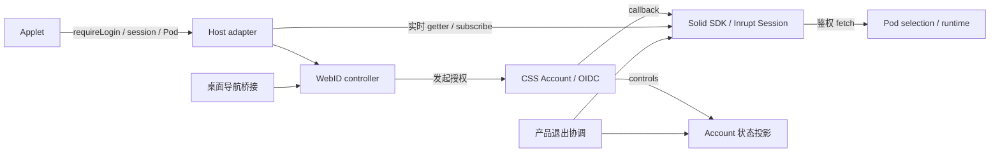

# 登录设计问答、覆盖缺口与模块边界

> **已归档（2026-09-19）。** 登录设计的唯一权威现在是
> [`../superpowers/specs/2026-09-19-xpod-login-and-host-design.md`](../superpowers/specs/2026-09-19-xpod-login-and-host-design.md)。
> 本文件的设计问答仍有说明价值，但两处结论已知不准确，不要直接引用：
> `:22` 要求的 `unknown` 态在代码中**不存在**（漂移 D-03）；
> `:76` 的"18 格均已有对应入口与部署证据"是叙述性归纳，
> 实际是 9 条测试映射 18 个设计格（漂移 D-10）。
> 逐条漂移与裁决见 [`login-design-drift-register.md`](login-design-drift-register.md)。

本表是 [登录状态矩阵](login-state-matrix.md) 的执行审计，配合
[本轮结果](login-audit-2026-09-15.md) 阅读。测试数量不能代替逐项证据；
“未执行”不等于“不适用”，通过一种部署不能扩称三种部署全部通过。

失败后的重试、返回、取消、窗口尺寸及新增实机证据见 [交互恢复设计与验收](login-interaction-recovery.md)。

## 设计问答与样例

| 问题 | 设计回答 | 具体样例与必须断言 |
| --- | --- | --- |
| 登录只有一个状态吗？ | Account、WebID、Pod 各自有权威 | CSS Account 已登录而 Inrupt 匿名时可看 Status；不能读取 Pod |
| Account B 关联 WebID A 能正常登录吗？ | 可以。Account ID 和 WebID 是不同类型的标识；一个 Account 可关联多个 WebID | 新授权按当前 Account 的关联列表选择 WebID，不能用两个 ID 的字符串是否相等判断身份冲突 |
| 同 issuer 的 Account B 与不属于它的 WebID A 能同时有效吗？ | 已签发的 WebID 会话可能在另一个标签页切换 Account 后继续有效；这不是产品“切换账号成功”的状态 | B 发起的新授权不得选择 A；管理页只用 B 的 Account 权限，applet 只用 A 的 WebID 权限，资料和凭据不能混用。正式产品切换先清理旧 WebID/Pod，再切换 Account；不能因 Account 失败而自动注销有效 WebID |
| 管理 Account 与外部 issuer 的 WebID 可以任意组合吗？ | 当前支持部署指定的 issuer，不承诺任意外部 issuer 或长期并用不同用户身份的业务模式 | Cloud issuer 与 Local Pod 的正常部署组合不等于双用户功能；20 项资料隔离测试也不构成该功能的验收 |
| WebID 已登录但 Account 不可用怎么办？ | 保留有效 WebID 与 Pod，不伪造 Account | Account controls 503，applet 仍可读 Pod；用户卡可退出、可切换 |
| Pod 暂不可达要重新登录吗？ | 保留已确认身份，重试 Pod 层 | OIDC code 只兑换一次；修复存储后重试打开同一绑定 |
| applet 必须先经过 Xpod 首页吗？ | 不需要，host 提供 `solid.requireLogin` | 从 AI Connections 或独立 origin 的 notes 页面发起；成功返回原路径、查询与片段 |
| applet 自己管理 Account 密码吗？ | 不管理；密码表单归身份服务，Session 归 host | 外部 applet 只调用 host capability，不拿 Account token 代替 WebID |
| Account 和 WebID 要用同一尺寸吗？ | 不需要，两种定位允许两套尺寸 | 分别验证键盘可达、错误可见、内容不截断；不通过强制等宽等高证明模块化 |
| 未知或损坏 controls 能当匿名吗？ | 不能，必须明确区分 unknown/error/anonymous | 丢 controls、非法 JSON、离线时退出保留重试；密码表单不报告成功 |
| 密码错误或邮箱不存在能否产生会话？ | 不能，错误响应不得包含认证产物 | 请求真实登录 API，检查拒绝状态、无 Account token/有效登录 cookie；不能仅检查页面能打开 |
| 重复注册相同邮箱怎样验收？ | 向新账户的真实 password create control 提交重复邮箱并明确拒绝 | 废弃路径的 404 不算重复邮箱校验通过；既有账户身份保持不变 |
| 产品退出等于退出全部 Cloud SSO 吗？ | 不等于 | 清理产品 WebID/Pod 与当前 Account 会话；跨站下顶层 IdP SSO 可能保留，另行记录 |
| 如何确保真的换账号？ | 旧身份清理后显式重新认证 | 标准 `prompt=login`；Cloud 可“换一个账号”；A→B 后 WebID/Pod 都是 B |
| 为什么不用固定 `select_account`？ | 未声明支持的 IdP 可能拒绝它 | 当前 Cloud 实际返回 unsupported prompt；标准 login 已完成无拦截验证 |
| 注册会把用户带到 Dashboard 吗？ | 只有无原任务时才用默认落点 | 原 applet → 注册 → 首 Pod → consent → 原 callback → 原 applet |
| 多个 Pod 怎么选？ | 使用精确 WebID/storage 配对 | 多个绑定显式选择；权限或元数据冲突不得静默选另一个 Pod |
| 记住邮箱能恢复认证吗？ | 不能，展示记录不是凭据 | SDK 会话有效才恢复；过期后可显示记住的信息，但不能访问受保护内容 |
| 记住账号和记住应用是同一个开关吗？ | 不是；前者决定 CSS Account Cookie 生命周期，后者决定 IdP 对 client/权限的授权记忆 | Account 表单的 `remember` 可关闭；consent 的 `rememberClient` 独立，不相互改写 |
| 不记住账号意味着刷新就退出吗？ | 不是；会话 Cookie 在同一浏览器会话内仍可用 | 检查服务端 session Cookie 属性；不得把页面刷新当作关闭浏览器，也不强制覆盖浏览器的“恢复上次会话”策略 |
| 记住应用能跳过新权限、撤销或账号切换吗？ | 不能 | 同 client 已授权范围可复用；新增权限、显式 consent、grant 撤销/过期、切换 Account 分别重新判断 |
| 恢复会话、续期和重新授权是一回事吗？ | 不是 | 恢复 SDK 状态、refresh token 兑换、携带新 state/code 的 OIDC 授权分别记录；已有公开 WebID/Pod 记录不算恢复成功 |
| 离线是否等于会话过期？ | 不是；网络失败不得把有效身份改成另一人 | 已加载 applet 的私有 Pod 请求失败后保留同一 SDK 身份，恢复网络可继续；明确的无效 token 走过期恢复 |
| 离线时能否显示“退出成功”？ | 只能对已完成步骤确认 | WebID 本地清理成功而 Account 服务不可达时显示退出未完成；恢复网络后只重试失败步骤，并验证原 Account control 被拒绝 |
| 回调兑换时断网能重用旧 code 吗？ | 通过新的登录事务恢复 | 注入真实请求网络中断；失败不产生 Pod-ready，在线重试使用新的 state/code |
| 完全离线冷启动能打开网页吗？ | 当前不承诺离线应用外壳 | 浏览器连 HTML/JS 都无法获取属于页面加载边界；不能用已加载页面的离线请求验收替代 |
| Standalone 桌面本地登录需要公网吗？ | 内置 client 的程序声明不依赖公网下载 | Provider、UI 和公开文档共用一个 JSON；真实 CSS adapter 下阻断公网 metadata，仍可进入本地 Account 授权；其他外部 client 保留自身发现要求 |
| 取消一个标签页会影响另一页吗？ | 不应影响 | A/B 各有 state、PKCE、interaction；取消 A 后 B 仍可完成 |
| 回调错误如何处理？ | 拒绝异常并给出对应恢复入口 | 上游授权错误与本地 state 错配分别呈现；不展示原始 error_description |
| 浏览器不能保存事务时怎么办？ | 报告存储不可用，不降级绕过事务校验 | 不启动没有可恢复 state/PKCE 关联的授权；回调不能仅凭 URL 宣告成功 |
| 密码恢复如何防止重放和枚举？ | CSS 生成并一次性消费记录 | 新密码成功、旧密码失败、token 重放失败；未知邮箱响应不泄露注册状态 |
| API 返回 models 200 等于 Chat 可用吗？ | 不等于 | 客户端认证、Pod 读写、models 与 Chat 分层报告 |

## 执行证据的范围

| 入口 / 部署 | 已执行证据 | 尚未证明 |
| --- | --- | --- |
| Xpod / 内置 applet，同源独立实例 | 最终组合 51/51、零重试，其中 shared-login 38/38：Account-only、WebID-only、注册、选择、刷新、退出、切换、异常 callback 和整页网络中断 | 原生 Pod HTTP/SDK 5 项与浏览器动作分别计数；不是每个公共部署都重跑所有负例 |
| Xpod / 内置 applet，当前 Managed Local | Gateway 3000；开发 UI 5173 与生产 UI 3000 的真实 Cloud 登录、回调、刷新、退出；实际 Pod 与客户端凭据 | 当前实例的多个真实用户/多个 Pod 数据隔离组合 |
| Managed Local 新注册，独立双实例 | 专用 Cloud+Local runner 验证注册、Local provisioning、consent、返回原应用；最终结果见本轮审计 | 公网节点直接 TLS 可达性与实际邮件投递 |
| Cloud / Managed Local / Standalone，正式 applet 浏览器矩阵 | Bun 1.3.12，最终联合 runner 浏览器 6/6：每种模式 AI Connections + AI Config；真实注册/登录、私有 Pod 写读与匿名拒绝、刷新、断网恢复、Status Account 身份、离线退出重试及原 Account control 401/403 | 同 site、不同 origin；不等于跨 site SSO 或所有负例的笛卡尔积 |
| 独立 origin applet host | 5/5：真实 Inrupt 消费者 → Xpod Account/OIDC → 外部原路由 → DPoP Pod 请求；A→B、刷新/退出、拒绝授权、state 篡改 | 仓库没有另一份独立生产第三方 applet；预置 Pod binding 与恢复策略属于测试 host，不证明通用发现或全局 SSO 退出 |
| 桌面，三模式真实服务 | 同一 runner 中 Electron 3/3：Cloud / Managed Local / Standalone 各验证 Account authority/webIdLinks、精确 WebID/Pod、私有写读与匿名拒绝、托盘同 document/renderer/session、第二实例唤回、完全退出后再读原私有文件；每格密码只提交 1 次 | 独立测试部署；未重跑公共 Cloud 的全部桌面组合、各浏览器与各操作系统；旧的公开 profile 检查已被私有读写补强 |
| CLI | 正式 password login → 新进程私有 Pod 读写 → logout → 新进程 `auth_required`，1/1；匿名读取 401/403；另有 SDK 持久恢复清理单元 | 当前 CLI 没有 browser login 发起命令；不能把 helper 发起 OIDC 称为 CLI 浏览器登录；已保存 OAuth 会话的跨进程 HTTP 恢复未单独执行 |
| API，当前 Gateway | CSS 临时凭据 models 200；错误 secret 401；撤销后原凭据 401 | Chat 未执行；可选 token cache 的撤销等待受 token 有效期约束 |
| 密码恢复 | 真实 CSS HTTP 与 token/password store；重放/篡改/过期拒绝；测试捕获邮件；页面 authority/returnTo 单元 | SMTP/实际收件箱与跨 host 页面完整续接 |

### 18 格设计目标的实际状态

这里按本轮证据判定；历史桌面实机结果仍可在状态矩阵的日期记录中追溯。
“协议”表示完整后端集成提供相应部署证据，不代表该格的前端动作链全部完成。
此前 shared-login 的同源 Local 夹具不能单独证明 Standalone；新增独立 runner 已按正式
Standalone（Local edition + 自有 issuer）与 Managed Local（独立 Cloud issuer）分别执行。

| 入口 / 层 | Cloud | Managed Local | Standalone |
| --- | --- | --- | --- |
| Web / Account | 公共 Cloud 登录/换账号表单；隔离 Cloud 两入口身份/服务端注销通过 | 当前实例与隔离独立 Cloud authority；同 site 两入口身份/注销通过 | 独立 Standalone 两入口身份/服务端注销通过 |
| Web / WebID | 隔离真实 Cloud 两入口、私有 Pod、恢复/退出通过；非公共 Cloud 用户 Pod 全链 | 当前 Gateway + Cloud issuer + Local Pod；隔离模式两入口恢复/退出通过 | 独立自有 issuer 两入口、私有 Pod、恢复/退出通过 |
| 桌面 / Account | 隔离 Cloud 身份/归属、进程重启后记住账号通过 | 独立 Cloud authority 身份/归属、进程重启后记住账号通过 | 自有 issuer 身份/归属、进程重启后记住账号通过 |
| 桌面 / WebID | 精确 Cloud Pod、私有写读、托盘、完全退出后私有再读通过 | 独立 Cloud issuer + Local Pod，同一完整桌面生命周期通过 | 自有 issuer + Local Pod，同一完整桌面生命周期通过 |
| applet / Account capability | 两个正式 applet 入口到 Cloud Account 的真实链路通过 | 两个正式入口到独立 Cloud authority 通过；Account 与 WebID 独立 | 两个正式入口到自有 Account authority 通过 |
| applet / WebID | 隔离 Cloud 两入口完整基础生命周期通过 | 内置 applet 当前实例与两入口矩阵通过；独立 host 另有协议验收 | 自有 issuer 的两个正式 applet 基础生命周期通过 |

18 格均已有对应入口与部署证据，具体强度见上表；这不表示每个故障、宿主、部署、浏览器和操作系统的笛卡尔积全部执行。

## 安全与故障样例矩阵

| 样例 | 当前证据 | 边界或缺口 |
| --- | --- | --- |
| controls 未知、网络失败、非法 JSON | AuthContext / credentials 单元；shared-login 故障注入 | 不将假设匿名当退出成功 |
| 正确密码、错误密码、不存在的邮箱、重复注册 | 强化 ServerLogin HTTP 12/12；正例用 token/cookie 分别确认精确 Account ID；负例 403/400 且无认证产物 | 删除接受 404 或未验证身份的宽泛“成功”断言；不是实际邮件验证 |
| 连续退出失败后重试 | 产品退出单元；真实浏览器两次 Account 503 后成功 | 已完成的 WebID 清理不重复执行 |
| 浏览器整页网络断开后恢复 | 新增 4/4：Account 表单、已认证私有 Pod 请求、退出、callback 兑换；使用 context offline 故障而非假成功响应 | 已加载文档；不承诺离线冷启动；三模式共用场景的执行状态另外记录 |
| 异步 controls 迟到 | generation 回归 | 旧响应不能恢复已退出身份 |
| 身份过期 | SDK/runtime 单元；浏览器模拟 refresh 401 的恢复入口；新增真实 Browser SDK：Access TTL 30 秒自动续期后私有 Pod 读取，Refresh TTL 5 秒真实 invalid_grant 后完整重登并读同一私有资源，两项分别通过 | 真实用例为隔离 Local + 原生 QLever；未扩称全部部署、浏览器或实际线上实例 |
| 记住账号 / 不记住 / 换账号 / 注销重放 | Account 15 文件 170/170；包含真实 CSS Cookie HTTP 与三种表单默认值、关闭、失败重试、pending 禁用 | Cookie 持久属性不等于强制控制浏览器“恢复上次会话”；三部署浏览器进程重启全组合未穷尽 |
| 记住应用 / 不记住 / 取消记住 / 新权限 / 撤销 / 到期 | 真实 Provider HTTP 16/16 与 grant 单元 17/17；包含授权前到期、同意页面打开后到期（容差内/外）、重新确认与拒绝；失效后重新计算完整 scope，不延长旧 grant | 产品容差 120 秒、协议夹具默认 15 秒；固定 desktop client 的记忆策略，不宣称所有第三方 client 都使用该策略 |
| Standalone 无公网 metadata | 真实 CSS client adapter + 正式 Provider 工厂，阻断公网请求仍进入授权；唯一 JSON 与 Vite 公开产物回归 | 此项证明本地已知 client 声明无公网依赖，不代表所有外部 IdP 或远程 Pod 离线可用 |
| 恢复后在线续期与失效 refresh | 实际 Inrupt Node SDK + 2 秒 token TTL，空闲计时器触发真实 refresh，再验证 UserInfo；session/grant 撤销拒绝 | UserInfo 是身份协议证明，不是 Pod 读写；Browser SDK 与三部署完整续期组合分别判定 |
| WebID 原文精确身份 | SQLite 原文身份/KV owner 保护；UI 字符串变体；真实 Provider 签名 token、Picker/owner 和 HTTP Profile RDF query 原文组合测试；受控 Profile/WAC/ACP 模板回归 | 协议夹具有显式 Account/PodManager 边界；未把其视为完整 Gateway 浏览器变体链，不自动迁移已有 RDF 资源 |
| Pod 权限/绑定失败 | 多 Pod、exact-pair conflict、Pod retry 单元和 E2E | 公开 profile 成功不算私有 Pod 权限 |
| 多标签 A→B / B→A | 真实 scoped interaction E2E | 独立 host 多标签与进程崩溃恢复未执行 |
| interaction cookie 缺失、篡改、串用 | 真实服务 E2E | 不消耗其它 pending interaction |
| 拒绝 consent / 丢 host transaction | 真实 provider response 与浏览器恢复 | 保持失败，不复用旧会话伪造成功 |
| 错误 returnTo / callback 重放 | 真实 code 回调和 fault injection | 不越域跳转；同 code 不重复兑换 |
| 上游不支持的授权参数 | 当前 Cloud 实际复现；错误分类单元；真实服务负例 | 不把 provider error 统一标成 state 错配 |
| 跨 issuer 混淆 | runtime 拒绝单元；两个真实 provider + Inrupt 的 3 项协议测试：正常、异源 code、异源签名 token；当前 Cloud issuer+Local Pod 正常链路 | 协议负例没有挂载 Host Pod/UI；不扩称三部署全部浏览器组合 |
| applet 退出/过期事件 | host 动态 snapshot 与通知通道回归 | 必须消费 SDK 当前状态，不能用创建 host 时的旧闭包 |
| 跨会话身份不一致（防御性测试） | 20 项 profile/用户卡测试验证资料与 Copy 不混用；新增真实服务 `account-webid-isolation.spec.ts` 1/1：同一浏览器第二标签页切 Account B 后，SDK A 私有写读成功，B Cookie 与匿名读取 A 私有资源均为 401/403，B 新授权不含 A 且强行选 A 被拒绝 | 证明已签发会话并存时的权限隔离，不代表双用户业务模式或所有身份漂移恢复组合。产品切换仍须清理旧 WebID/Pod；不能直接比较 Account ID 与 WebID 字符串判断归属。该条已分别在原开发工作区和 0.4.6 候选的独立真实服务中通过，仍不是生产在线验收 |
| 客户端 secret/issuer 缓存隔离 | 单元与实际 Gateway 错误 secret/撤销测试 | 可选缓存不开启时的实机结果不扩称启用缓存后即时撤销 |

## 组件模块化评估

箭头表示依赖/能力调用，不表示 Account 已登录必然等于 WebID 已登录。Account 与 WebID 的展示可以独立设计。

| 模块 | 权威与职责 | 评估 |
| --- | --- | --- |
| CSS / AuthContext | Account 登录与 controls；状态投影 | 边界清楚；多个派生字段与同步 ref 仍需一致维护，后续可收敛状态转换 |
| Solid SDK Session | 单个 Inrupt Session 的初始化、事件、注销与鉴权 fetch | 应由所有消费者复用，禁止 host 另存第二份认证事实 |
| WebID controller / boundary | 事务与授权请求；WebID 入口和恢复展示 | 与 Account 分开；标准重新认证意图复用已有参数接口 |
| Pod selection / runtime | 精确绑定、打开 Pod、重试存储 | 与身份失败分开；认证前 Account 绑定选择与认证后 WebID 选择不应机械合并 |
| 产品退出协调器 | 跟踪两层清理进度及重试 | 独立于会卸载的业务/用户卡，属于操作进度而非新认证权威 |
| applet host adapter | 把 SDK 能力暴露给 applet；通知消费会话事件 | 已修复旧状态闭包并通过回归；直接委托 SDK，删除重复投影 |
| Callback app | 事务校验、SDK 回调、Pod 恢复与展示 | 行为已有门禁；编排/存储恢复/React 展示仍在同模块，可后续分离 service 与 adapter |
| Profile identity hook | 有效 WebID 展示只来自该 WebID；Account-only 使用 Account | 已补跨身份资料失败、加载与缺昵称回归；卡片复用单个 handle，展示与 Copy 一致 |
| Desktop bridge | 原 WebContents 导航、窗口关闭/唤回 | 只做宿主适配，不承担第二套认证；托盘文档保持有实际测试 |

**结论：**核心认证权威与组件职责已分开；不以“两套尺寸”认定模块化不足。
动态事件契约缺陷属于本轮修复范围。Callback/AuthContext 的职责进一步收敛属于可维护性工作，
应先写拆分计划并保持已有回归，不为通过本轮验收重写认证内核。

## 未覆盖事项如何处理

- 跨 issuer 的真实协议负例、独立 host 的生命周期与安全用例已补，不扩称不存在的第三方生产应用。
- 三部署桌面基础生命周期已补齐；SMTP 与恢复页面端到端、各操作系统/浏览器仍显式未执行。CLI 按已有 password 发起与持久恢复能力验收，不凭空补一条浏览器登录产品路径。
- 布局另按 Account/WebID 两种职责验收，页面尺寸可以不同。
- 完整集成中的配置跳过不计为通过：本轮包括原生 RDF、local QLever 凭据专项、seed 矩阵与 Chat 专项的部分用例；原生 Pod 另有独立 HTTP/SDK 通过证据，浏览器 UI/OIDC 由 shared-login 与部署矩阵分别验收。
- 最新源码完整集成两轮均为 lite 151 通过 / 6 跳过、full 45/45。并发时曾出现 ChatKit 15 秒超时，原门限单文件与后续两次全量均通过；该负载敏感性及根测试 TypeScript 工具链问题仍在审计中明确记录。
