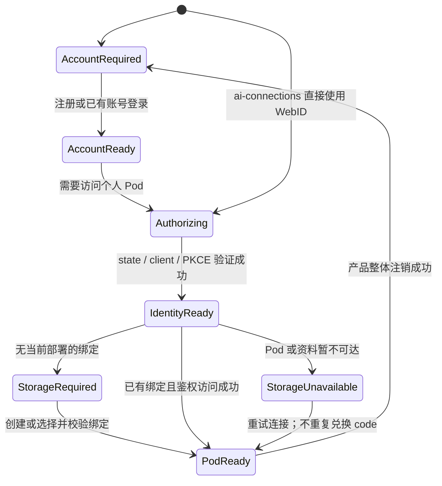
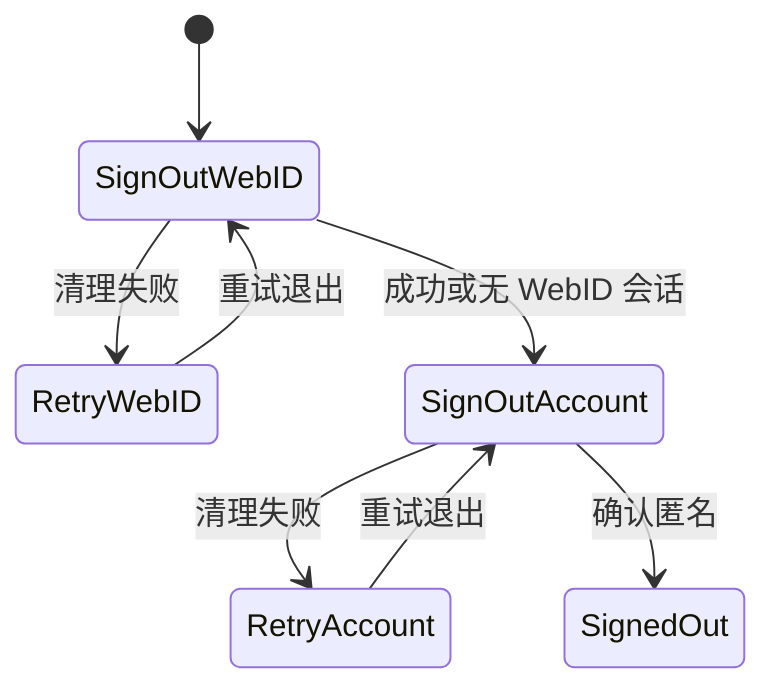

# 登录状态与验收矩阵

2026-09-15 的补充审计、修复及独立验收结果见 [本轮登录审计](login-audit-2026-09-15.md)。
逐项设计问答、执行边界、未覆盖情形与模块化评估见 [覆盖与模块边界](login-coverage-and-modularity.md)。
失败后可执行的恢复操作与验证结果见 [交互恢复矩阵](login-interaction-recovery.md)。

本矩阵覆盖 Xpod Web、桌面壳和 ai-connections 应用，分别检查 Account 登录与 WebID 登录；部署包括 Cloud、托管 Local、Standalone。开发者模式是正交运行条件，不是第四种身份服务。

登录发起方同时覆盖 Xpod 入口、内置 applet 与独立 origin 的 applet host。Account 登录与 WebID 登录定位不同，可以各用一套尺寸；共享身份协议与状态边界不要求共享窗口尺寸。

## WebID 身份比较约束

WebID 的完整字符串是身份键，包含协议、域名、端口、全部路径、query 和 fragment。URL 解析只用于格式与安全校验，不得把 `URL.href`、移除默认端口、大小写转换或去除 fragment 后的值用于替换身份、去重或关联账号。不同原文不得自动合并；同一原文才允许复用绑定。

Account WebID 登录链接不是 Pod 所有权。Pod 缺少明确 owner 或自身 WebID 记录时，不能因同账号、只有一个 Pod 或命中账号索引而推断绑定。管理列表仍可列出该 Pod，但登录必须停在可恢复的缺绑定状态；不得将空绑定自动解释为“从未创建 Pod”而新建替代品。

此约束贯穿 Pod 查找、所有权与角色解析、provision 链接复用、授权选择、首次 Pod 创建结果、登录事务和记住登录，以及 SDK 的 storage selection、运行时缓存和清理键。存储地址与 issuer 的地址规范化是不同职责，不以 WebID 的身份比较规则代替。

验收必须包括：主机大小写、显式默认端口、路径点段、query、fragment 不同的 WebID 均不得互认；相同原文可匹配；记忆记录与当前会话的原文不一致时不可自动恢复成同一身份。此前将 URL 归一化变体视为同一身份的构造样例不作为业务预期。

## 状态归属

不另造一个覆盖 CSS 和 OIDC 内核的大状态机。组合现有三个状态源，并对它们之间的转换作验收：

| 层 | 权威与状态 | 成功证据 | 不能当作成功证据 |
| --- | --- | --- | --- |
| Account | CSS Account API；initializing / anonymous / submitting / authenticated / error | 当前 authority 的 controls.account 与 account ID | 已记住的邮箱、头像、WebID token |
| WebID | Inrupt / Solid SDK；initializing / anonymous / authenticated / expired / error | 当前 OIDC 事务完成，issuer、state、PKCE、WebID 校验通过 | Account cookie、注册接口成功、client_id 存在 |
| Pod | Solid SDK storage selection 与 Pod runtime | 精确 WebID/storage 配对；实际鉴权读写命中预期 Pod | `/v1/models` 成功、仅发现 public URL |
| 记住 | CSS cookie、SDK 已接受会话、公开展示记录分别保存 | 刷新、重开、过期后的实际恢复行为 | 把公开展示记录当认证凭据 |

合法组合包括：Account 已登录而 WebID 未登录；WebID 已登录而 Account 不可用；WebID 已登录而 Pod 不可达。Account 与 WebID 独立不意味着产品的“切换账号/退出登录”可以保留旧用户的 Pod 供新用户使用。



图中 AccountReady 不是 WebID 授权的通用前提。ai-connections 的 Provider 数据由 WebID/Pod 会话授权；Account capability 只用于账户操作。

产品退出仅协调两层认证的清理进度，不建立新的身份来源。恢复界面必须位于会被认证变化卸载的头像和业务路由之外：



退出过程中阻止自动登录。已成功的 WebID 清理不因 Account 重试而重复执行；只有两层均完成才展示整体退出完成。

## 18 个检查点

以下是设计验收目标，不是 18 格全部实测通过的声明；本轮实际执行范围见 [覆盖与模块边界](login-coverage-and-modularity.md)。
每个“入口 × 部署”的目标动作链同时采集 Account 与 WebID 两个检查点，避免机械复制相同测试。

| 入口 / 层 | Cloud | Local | Standalone |
| --- | --- | --- | --- |
| Web / Account | W-A-C：Cloud Account | W-A-L：Cloud Account，不复制本地账号 | W-A-S：独立实例 Account |
| Web / WebID | W-I-C：Cloud issuer + Cloud Pod | W-I-L：Cloud issuer + 当前 Local scope | W-I-S：独立 issuer + 本实例 Pod |
| 桌面 / Account | D-A-C：Cloud Account | D-A-L：经本机入口使用 Cloud Account | D-A-S：独立实例 Account |
| 桌面 / WebID | D-I-C：原 WebContents 回调 | D-I-L：原 WebContents 回调 + Local Pod | D-I-S：独立 issuer，不能依赖默认 Cloud 域名 |
| ai-connections / Account | A-A-C：可选 Cloud Account capability | A-A-L：可选 Cloud Account capability | A-A-S：可选本实例 Account capability |
| ai-connections / WebID | A-I-C：Cloud Pod 数据 | A-I-L：当前 Local Pod 数据 | A-I-S：本实例 Pod 数据 |

桌面是客户端外壳，不能从壳自身环境变量猜测目标 Gateway 的 issuer。ai-connections 既检查直接打开，也检查从已登录 Shell 进入。

## 首次从应用注册的续接

从 ai-connections 发起的任务不能被账号注册页改成 Dashboard 任务。Cloud、Standalone 与匿名 Managed Local 均遵循：原应用 → 原 OIDC interaction → 身份服务内登录或注册 → 当前范围的 Pod 就绪 → consent → 原 callback → ai-connections。

Managed Local 的前置步骤只等待部署发现；已有 Account 会话可以先检查 Local Pod，但匿名用户不得先在 Local 表单通过跨域 Account API 登录或注册。该 API token 并不建立 Cloud 身份服务的浏览器会话，随后再开启 OIDC 会要求第二次输入密码。身份服务内注册则保留原 interaction 与浏览器会话。

其他明确的账号页面入口仍携带同源应用 returnTo；完成注册及就绪重试时，优先继续已有 consent，其次恢复原应用，只有两者都不存在才采用账号页默认落点。Account 注册成功只是前置条件完成，不代表用户要去 Dashboard。

本机地址不能代替服务角色判断。Cloud 即使运行在 localhost，也必须把 provisioning 请求发送到 interaction 中的 SP；只有发现为 Managed Local 的当前页面，才允许将规范 SP 地址映射到本机 Gateway。双实例测试覆盖这个边界。

可重跑的真实双实例注册验收（需要 Docker 与已安装的原生 QLever，不依赖外部 Cloud）：

```sh
XPOD_PLAYWRIGHT_SYSTEM_CHROME=1 \
XPOD_QLEVER_LOCAL_RUNTIME_COMMAND=/Applications/Xpod.app/Contents/Resources/runtime/qlever/bin/xpod_qlever_local_runtime \
bun --no-env-file tests/helpers/runManagedLocalRegistration.ts
```

该入口创建独立 Cloud / Local、PostgreSQL / Redis / MinIO，完成后清理；浏览器只注册一次，随后只允许 consent，不代填第二次密码。`XPOD_E2E_LIVE_URL` 可用于显式验收已有实例，未指定时单独的 live spec 跳过；该模式会创建普通测试账号，私有恢复资料保存在 `.test-data/`。

## 动作样例与断言

| 样例 | 操作 | 必须断言 |
| --- | --- | --- |
| 新注册 | 全新 A → Account → 首个 Pod → WebID → 数据访问 | Account 成功不伪造 WebID；只创建一次当前部署 Pod |
| 已有账号 | 注销后以 A 登录 | 同一个权威 Account ID；已有 Pod 不重复创建 |
| 归属缺失 | 同 Account 下 A/B WebID，已有 Pod 无明确 owner | 两种身份存储都不返回推测绑定；账号管理仍能看到 Pod；首次创建入口不写新 Pod，重试读取或返回账号 |
| 迁移残留 | legacy 与 canonical 有相同 Pod ID，但 owner 或存储地址不同 | canonical 整条记录优先，不拼接身份与地址；canonical 缺 owner 或损坏时不复活旧 owner |
| URL 前缀不同 | 协议、主机或端口不同，后面的路径相同 | 原文身份不同，只匹配各自明确 owner；不得同路径关联到同一个 Pod |
| 切换账号 | A → B；两者有不同 Pod 数据 | 旧 WebID/Pod 被清理；B 不展示或操作 A 的数据；迟到异步结果不覆盖 B |
| 记住账号 | 登录 → 刷新 → 关闭/重开 | 分别检查 Account cookie、SDK session 和展示记录；失效时允许安全重新认证 |
| 注销 | 产品退出；注入单层失败后重试 | 两域成功才报告整体成功；失败层可重试，不能静默保留另一层 |
| Cloud 后续 Local | 已有 Cloud A/Pod → 未绑定 Local → 使用已有账号 | Cloud Account ID 不变；Local receipt/绑定合法；实际请求命中 Local；Cloud Pod 保留 |
| 两标签 | A 停在 IdP；B 登录/注销/silent restore；A 返回 | A 的 client/PKCE 不被 B 覆盖；忙状态可见且可恢复 |
| Callback 重试 | OIDC 成功后令 Pod 失败 → 恢复 | code 只兑换一次；保留身份；重试全部绑定/Pod检查 |
| Callback 异常 | 过期、重复、篡改 state/route、跨 issuer | 拒绝异常，不用新 client 去兑换旧 code，不放宽绑定检查 |
| 桌面生命周期 | 托盘关闭/重开；完全退出/重开 | 托盘保留原 renderer；冷启动按持久会话规则恢复；OIDC 不外开丢失 PKCE |

“同一个 Cloud Account”不保证 Local 与 Cloud 使用同一个 WebID；必须记录实际选中的 WebID/storage 配对，不能用相同邮箱代替账户同一性证据。

回调重放按原始 authorization code 的兑换次数验收；SDK 后续合法静默认证可能产生新的 code，不能把所有 token 请求合并视为重放。已有有效会话可返回安全的同源工作区，但未验证的响应不得改变身份、Pod 绑定或完成另一笔待处理事务。

## 开发者模式

- 使用 `bun run dev` / `bun run dev:monitor:desktop` 常驻监控，固定应用 origin；Vite 覆盖 Account、Dashboard、ai-connections 和 callback。
- `--gateway` 是实际连接地址，`CSS_BASE_URL` 是规范身份/存储地址，两者不能混用。
- 开发者模式保留真实 Account/OIDC/PKCE/Pod 授权。`open`/`apiOpen`、mock Session、注入 token 不构成登录验收。
- 检查 HMR 前后 client/state 关联、完整 authorize/callback、刷新恢复。monitor 自动构建并重启后端与桌面主进程；分别验证前端 HMR、后端响应变化和实际进程重启，不能互相替代。
- 开发种子账号只验证实际启用了对应 seed 的实例；不能拿它们猜测 Cloud 账号。

## 执行入口和证据分级

- SDK 状态与样例：`bun run --filter '@undefineds.co/solid-sdk' test`。
- ai-connections 模块：`bun run --filter '@undefineds.co/ai-connections' test`。
- Host 状态组合：`bun run test -- ui/src/auth ui/src/context ui/src/solid ui/src/extensions`。
- 桌面策略与生命周期单元：`cd desktop && bun run test`。
- 真实浏览器产品样例：`XPOD_PLAYWRIGHT_SYSTEM_CHROME=1 bunx playwright test tests/e2e/shared-login.spec.ts tests/e2e/desktop-login-lifecycle.spec.ts`。
- 三模式浏览器与桌面：设置原生 QLever 命令后运行 `XPOD_PLAYWRIGHT_SYSTEM_CHROME=1 bun run test:integration:auth:matrix`；共用隔离三服务，浏览器 6 项后执行桌面 3 项。
- 完整后端回归：`bun run test:integration`。

`xpodSettingsFixtureServer` 是临时同源 IdP 栈，其通过只能证明产品状态组合，不能扩称为生产 Cloud→Local 跨 origin 已通过。真实 Gateway 的独立验收要记录目标 origin、issuer、Account ID、选中 WebID/Pod、token 成功及实际鉴权读写；报告只保留存在性/状态码，禁止记录密码、token、PKCE verifier 或完整 provisionCode。

## 测试类型与替身边界

测试命令名不能替代证据分类，以下计数不能合并称为“全部无 mock 的真实集成测试”。

| 类型 | 覆盖内容 | 替身与限制 |
| --- | --- | --- |
| Host / SDK / ai-connections / 桌面单元测试 | 状态转换、组件行为、导航和存储契约 | 使用 mock、stub 或内存状态；不证明真实服务可用 |
| `test:integration:lite` / `full` | 启动隔离 Xpod；full 另使用容器数据库等基础设施 | 启动脚本使用 `createFakeQleverRuntimeCommand`；lite 纳入 `ChatMockFlow.test.ts`，其中认证、Pod 读取和 AI 响应被替换，不能作为真实 Chat 证据 |
| 登录浏览器 / 桌面 E2E | 真实浏览器或 Electron 连接隔离 Xpod，执行登录与生命周期操作 | 故障用例会拦截响应、注入 503、修改本地事务状态；夹具另有返回固定数据的 OpenAI 兼容 Provider，不能作为真实 AI 证据；夹具不等于当前部署实例 |
| 当前实例验收 | 3000 Gateway、真实 Cloud Account / OIDC，以及实际 Local Pod 鉴权读写 | 正常链路未替换认证或 Pod；退出恢复另有明确标注的 503 故障注入，不包含真实 AI Chat 验收 |

运行依据：`scripts/run-integration-lite-local.ts`、`scripts/run-integration-full.ts`、`tests/integration/ChatMockFlow.test.ts`、`tests/e2e/shared-login.spec.ts`。报告必须分别列出正常真实链路、故障注入和替身测试。

## 本次验收记录（2026-09-12—13）

| 范围 | 证据与结果 | 边界 |
| --- | --- | --- |
| 真实托管 Local + Cloud Account | 当前 Gateway `http://127.0.0.1:3000`；issuer `https://id.undefineds.co/`；专用账号注册、已有账号登录、当前 Local Pod 绑定、authorize/callback/token 均成功 | 公网节点域名从本机直连仍出现连接重置；通过真实 Gateway loopback transport 访问规范 Local Pod |
| 正式 Web 与开发 Web | 3000 静态入口与 5173 Vite 入口都进入 ai-connections，token 200；正式入口产品退出返回登录选择，Cloud Account logout 200 | 不等同于已部署更新远端 Cloud 前端 |
| 真实退出故障恢复 | 3000 入口已登录会话中注入 Account logout 503，恢复界面保留；重试取得真实 Cloud logout 200，回到登录选择 | 故障由浏览器拦截注入，重试连接真实服务；证据 `logout-recovery-result.json` |
| 真实 Pod 数据 | ai-connections 使用 drizzle-solid 创建测试连接，DPoP PATCH 201；重新读取 200；删除 PATCH 205，界面回到未设置 | 使用无效测试密钥验证持久化，已清理；不声明 Provider 或 Chat 可用 |
| 两标签页 | A 停在 Cloud IdP 时 B 显示占用提示；A 的 SDK client/PKCE 存储摘要保持不变 | 同一 origin；浏览器必须支持 Web Locks |
| 真实桌面登录 | 独立测试 profile，Cloud 认证后回原窗口，token 200，ai-connections 可用，始终一个窗口；冷启动重新认证也完成 token 200 | 托盘与自动恢复另由生命周期样例验证 |
| 桌面生命周期 E2E | 真实 Electron 测试通过：首次仅一次密码提交、记住授权、PodReady、托盘、服务存活、第二实例唤回相同 renderer、完全退出后恢复或安全重登入口 | 使用隔离 Xpod 夹具；不将记住账号当作已认证会话 |
| 浏览器状态与恢复 E2E | `shared-login.spec.ts` 全套 24 项一次运行通过，覆盖双域独立失败、首次建 Pod、切换、回调恢复/重放/篡改、双层注销重试 | 使用隔离 Xpod 夹具；不替代上列真实 Gateway 验收 |
| 模块与后端 | Host 认证相关 324 项、Solid SDK 74 项、ai-connections 356 项、桌面 125 项通过；完整集成 lite 149 项、full 45 项通过，6 项显式跳过 | 三种模式的 full suite 是隔离协议回归，不能将 18 格全部标成真实部署通过 |
| 无 fake QLever 的本地 Pod 模式 | `XPOD_E2E_REAL_POD=1` 下 Web 24 项、Electron 生命周期 1 项通过；新增私有文件读写、匿名拒绝、跨账号拒绝、fresh drizzle 客户端 RDF 读回，以及安装版原生 QLever 集合查询共 5 项通过 | 真正隔离 Xpod、Account/OIDC/DPoP/Pod；故障 E2E 仍包含明确网络注入；不代表真实 Chat |
| 构建与静态检查 | UI 四入口构建、后端 TypeScript、UI ESLint、diff whitespace 检查通过 | 已补齐共享 Provider 目录的 CJS 导出并验证 CSS 加载；构建仍有既有 chunk size 提示 |

进程强杀恢复边界：成功登录会删除占用 lease。若未认证的 SDK 恢复操作进行中被强杀，持久 lease 最多保留 10 分钟，期间其它页面安全拒绝新操作；不能仅因 Web Lock 消失就清理，因为正常跳转 IdP 也会释放它。正常返回和可捕获失败会立即释放。

证据保存在本机 `.test-data/login-redesign/`，包括 `production-web-result.json`、`local-webid-result.json`、`client-race-result.json`、`provider-write.json`、`provider-delete.json`、`logout-result.json`、`desktop-live-result.json` 及各测试日志。该目录包含私有测试 profile 和会话，不应提交或整体分享。

2026-09-13 开发重启发现并修复测试污染：`tests/api/runtime.test.ts` 的一条 provisioning mock 用例曾写入默认开发注册文件。该文件及 ProvisionHandler 写入测试现统一使用独立 `.test-data/` 目录并清理，46 项回归通过。真实设备注册已按原 `data/.device-id` 恢复并取得新的 Cloud 凭据；Pod 数据未清理。

### 首登注册专项验收（2026-09-13）

- 真实同源 OIDC 注册：1/1 通过。
- 真实独立 Cloud + Managed Local 注册：1/1 通过，注册 → consent → Local callback → 原 ai-connections；新 Pod 创建 201、consent/token 200、浏览器读取新 Pod profile 200，所选 WebID/storage 匹配本次账号，注册后密码 POST 为 0，无 Dashboard 跳转。测试容器和服务已清理。
- 相关 UI 状态和地址选择测试：110 项通过；UI TypeScript、ESLint 与四入口构建通过。
- 最终完整集成回归：以 `VITEST_MAX_FORKS=1 VITEST_MIN_FORKS=1 bun run test:integration` 运行，lite 149 项通过、6 项跳过，full 45 项通过，退出码 0；日志为 `.test-data/registration-return-integration-single-worker.log`。此套件的替身边界仍以上表为准。
- 现有外部 Cloud + 本机 Local 的规范节点域名 TLS 不可达，实际新 Pod provisioning 验收停在注册准备阶段；不得把上述隔离双实例通过表述为该公网节点通过。

可追溯证据：`.test-data/managed-registration-double-stack-final.log` 与 `.test-data/managed-local-registration-cY8biY/navigation.json`。恢复凭据仅存私有测试文件，不纳入文档或提交。
